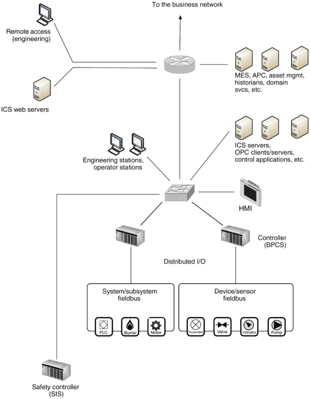

# Industrial Network Security

> Securing Critical Infrastructure Network for Smart Grid, SCADA, and Other Industrial Control Systems

# 2. About Industrial Networks

## Attacks, Breaches and Incidents: Malware, Exploits and APT's

The focus of this book is how an attack might occour and subsequently how to best protect the Industrial Network and the connected ICS components against undesirable consequences that result from this action.
Did  the action result in some outcome—operational, health, safety or environment—that  must be reported to a federal agency according to some regulatory legislation? 
Did it  originate from another country? 
Was it a simple virus or a persistent rootkit? 
Could it be achieved with free tools available on the Internet, or did it require the resources of a state-backed cyber espionage group? 
Do such groups even exist?

## Asset, Critical Asset, Cyber Asset, and Critical Cyber Assets

* *Asset:* Component that is used within an industrial control system. 
    * Often physical (Workstation, server, network switch)
    * Also logical (Process graphic, database, logic program, firewall sule set or firmware)
    * In this book, any component of the network is called an asset

* *CCA:* Critical Cyber Asset: device that uses a routable protocol within a control center or is dial-up accessible. In version 5 of the standars, this change to take on a more holistic approach, taking into account BES (Bulk Electric Systems)

## Security controls and Security countermeasures

These terms simply refer to methods of enforcing cybersecurity in order to reduce risk

## Firewalls and IPS's

Basic firewalls may not be able to distinguish between what is a request and what is a response
* *Deep Packet Inspection system *is a device that can decode network traffic and look at the contents or payload of that traffic.
It is typically used by IDS's, IPS's, advanced firewalls and many other systems to detect signs of attacks.
* Industrial Networks support high availability making most general IPS appliances less common on critical networks; IPS is more often applied at upper level networks where high availability (>99.99%) is not such a high priority.

## Industrial Control System

* *An Industrial Control System (ICS)* is a broad class of automation systems used to provide control and monitoring functionality in manufacturing and industrial facilities.
Aggregate of a variety of diferent system types
    * *Process Control Systems (PCS)*
    * *Distributed Control Systems (DCS)*
    * *Supervisory control and data acquisition (SCADA) systems*
    * *Safety instrumented systems (SIS)*
    * And many others

## DCS or SCADA

Both systems are designed to monitor and to control manufacturing or industrial equipment.

ICS are often refered to in the media as SCADA, wich is both inaccurate and misleading.
A SCADA system is a ICS, but not all ICS ara SCAADA.

## Industrial Networks

The various assets that comprise a ICS are interconnected over an industrial Network.

Following Stuxnet, there has been a open source revision of the protocols that where in place. These protocols where found to have critical security bugs, wich instigated the critical industry sector to migrate to propietary protocols, often too cost-prohibitive for researches to procure and analyse.
    
## Networks, Routeble Networks, and Nonroutable Networks

A *Nonroutable network* refers to those serial, bus and point-to-point comuniication links that utilize **Modbus/RTU**, DNP3, fieldbus and other networks.

A *Routable network* tipically means a network utilizing the protocol TCP/IP or UDP/IP although other protocols such as AppleTalk, DEVnet and others certainly apply.

In a industrial network, it is common that routable and nonroutable networks interconnect or overlap.

All networks and all devices should be considered potentially accessible and vulnerable.

## Enterprise or business networks

