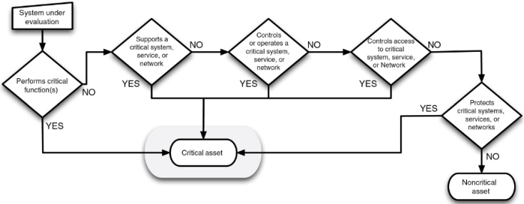
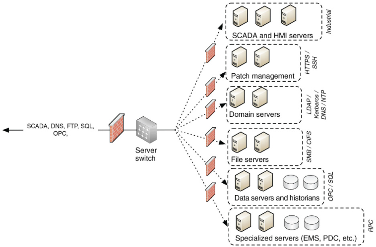
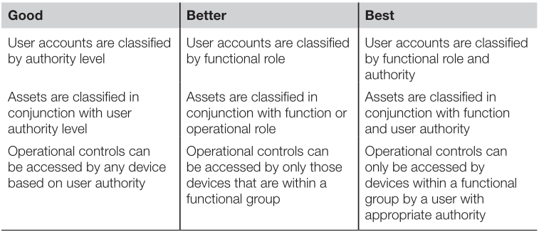
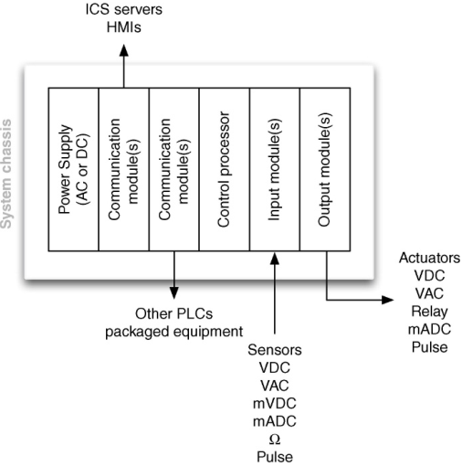
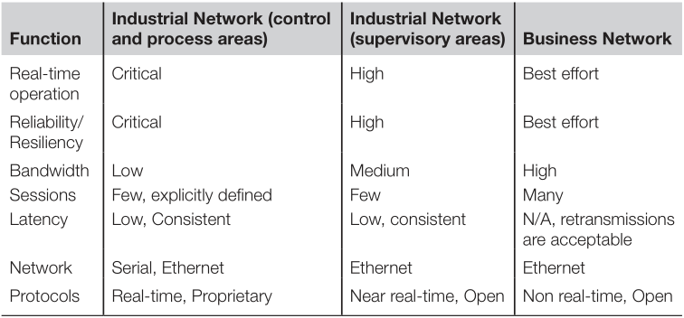
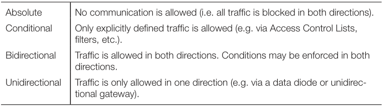
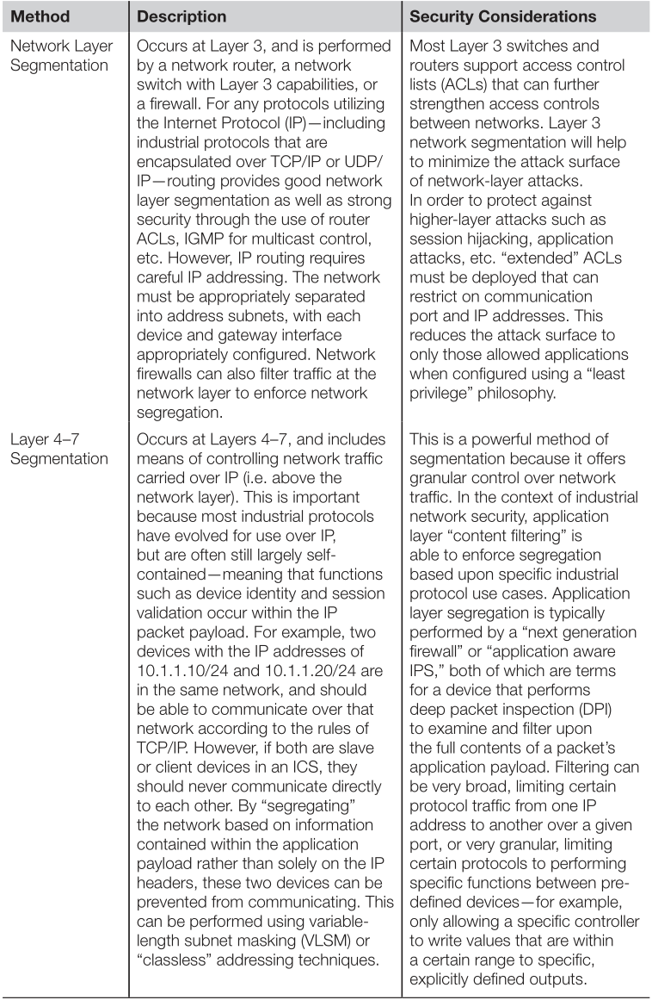
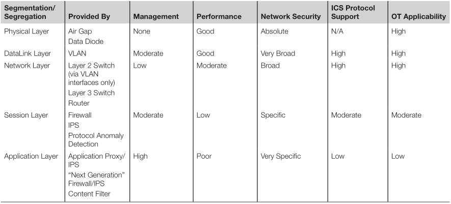

# Industrial Network Security

> Securing Critical Infrastructure Network for Smart Grid, SCADA, and Other Industrial Control Systems

# 2. About Industrial Networks

## Attacks, Breaches and Incidents: Malware, Exploits and APT's

The focus of this book is how an attack might occur and subsequently how to best protect the Industrial Network and the connected ICS components against undesirable consequences that result from this action.
Did  the action result in some outcome—operational, health, safety or environment—that  must be reported to a federal agency according to some regulatory legislation? 
Did it  originate from another country? 
Was it a simple virus or a persistent root kit? 
Could it be achieved with free tools available on the Internet, or did it require the resources of a state-backed cyber espionage group? 
Do such groups even exist?

## Asset, Critical Asset, Cyber Asset, and Critical Cyber Assets

* *Asset:* Component that is used within an industrial control system. 
    * Often physical (Workstation, server, network switch)
    * Also logical (Process graphic, database, logic program, firewall slue set or firmware)
    * In this book, any component of the network is called an asset

* *CCA:* Critical Cyber Asset: device that uses a Routable protocol within a control center or is dial-up accessible. In version 5 of the standard, this change to take on a more holistic approach, taking into account BES (Bulk Electric Systems)

## Security controls and Security countermeasures

These terms simply refer to methods of enforcing cyber security in order to reduce risk

## Firewalls and IPS's

Basic firewalls may not be able to distinguish between what is a request and what is a response
* *Deep Packet Inspection system *is a device that can decode network traffic and look at the contents or payload of that traffic.
It is typically used by IDS's, IPS's, advanced firewalls and many other systems to detect signs of attacks.
* Industrial Networks support high availability making most general IPS appliances less common on critical networks; IPS is more often applied at upper level networks where high availability (>99.99%) is not such a high priority.

## Industrial Control System

* *An Industrial Control System (ICS)* is a broad class of automation systems used to provide control and monitoring functionality in manufacturing and industrial facilities.
Aggregate of a variety of different system types
    * *Process Control Systems (PCS)*
    * *Distributed Control Systems (DCS)*
    * *Supervisory control and data acquisition (SCADA) systems*
    * *Safety instrumented systems (SIS)*
    * And many others

## DJs or SCADA

Both systems are designed to monitor and to control manufacturing or industrial equipment.

ICS are often referred to in the media as SCADA, which is both inaccurate and misleading.
A SCADA system is a ICS, but not all ICS are SCADA.

## Industrial Networks

The various assets that comprise a ICS are interconnected over an industrial Network.

Following Stuxnet, there has been a open source revision of the protocols that where in place. These protocols where found to have critical security bugs, which instigated the critical industry sector to migrate to proprietary protocols, often too cost-prohibitive for researches to procure and analyse.
    
## Networks, Routable Networks, and Nonroutable Networks

A *Nonroutable network* refers to those serial, bus and point-to-point communication links that utilize **Modbus/RTU**, DNP3, fieldbus and other networks.

A *Routable network* typically means a network utilizing the protocol TCP/IP or UDP/IP although other protocols such as AppleTalk, DEVnet and others certainly apply.

In a industrial network, it is common that Routable and Nonroutable networks interconnect or overlap.

All networks and all devices should be considered potentially accessible and vulnerable.

## Enterprise or business networks

> Network of systems that provide the information infrastructure to the business. They can be suppliers that provide the raw material, customers, that receive the finished product.

In the end, the business network and the industrial network interconnect to make up a single end-to-end network

It should be noted that there are several systems and services that exist in both networks, such as directory services, file servers and databases. 
These common services should not be shared, rather replicated, to minimize interconnectivity and reduce potential attack surfaces of both ICS and enterprise infrastructure.

## Zones and enclaves

> Closed group of assets or a functional group of devices, services and applications that make up a larger system. 

* *Zone:* A spatial network that has been created to expose a subset of resources to a larger, untrusted network.

While highly effective, there are times that they become unpractical, because of the complexity of controlling a single device over a network. (Smart grids)

## Network perimeters or electronic security perimeters

* *Perimeter:* The outermost boundary of any closed group of assets (zone) 
    * It is a logical point in which implement cyber security controls.
    * Typically consist of Firewalls, IPS or similar network-based filters

## Critical infrastructure

* *Industrial Networks:* are referred to as any network operating some sort of automated control system that communicates digitally over the network. 
* *Critical Infrastructure:* is referring to the critical *systems and assets* used within a network computing infrastructure.

### Utilities

Water, wastewater, gas, oil, electricity and communications are critical national infrastructures that rely heavily on industrial networks and automated control systems.
They are also clear examples of industrial networks.

### Nuclear facilities

High target for hackers, very secure and protected by law

### Bulk electric

Defined as critical infrastructure under HSPD-7 and highly regulated in North America by NERC.

### Smart Grid

Is a modernization of energy transmission, distribution, and consumption systems.
It will be used as an example in this book, because, as it has become "smart", the devices and components that make up the transmission, distribution, metering, and other components of the grid infrastructure have become sources of digital information, have been given distributed digital communication capability, and have been highly automated.

### Chemical facilities

Unlike the Utility networks, they have to secure their intellectual property as much as they do their control systems and manufacturing operations.

## Common Industrial Security Recommendations

1. Identify what systems need to be protected
1. Separating the systems logically into functional groups
1. Implementing a defense in depth strategy around each system or group
1. Controlling access into and between each group
1. Monitoring activities that occur within and between groups
1. Limiting the actions that can be executed within and between groups

### Identification of critical systems

The first step is determining what needs to be protected. 
Identifying the assets that need to be secured and their overall importance to the reliable operation of the overall Integrated System.
When determining what needs to be protected, we have to map every existing device, and determine if it is a critical asset or not. 

### Network Segmentation / Isolation OS Systems

Segmentation of assets into functional groups allows specific services to be tightly locked down and controlled, and is one of the easiest methods of reducing the attack surface that is exposed to potential threat actors. 

### Defense in depth

A defense in depth strategy should be implemented.

### Access Control

Most difficult, but important aspects of cyber security.
Considers 3 very important aspects of how a user interacts with resources.

* Identification
* Authentication
* Authorization

The successful implementation of access control is difficult because of the complexity of managing users and their roles and their mapping to specific devices and services that relate specifically to an employee's operational responsibilities.

The strengths of Access Control increases as a user's identity is treated with the additional context of that user's roles and responsibilities within a functional group.

## Advanced Industrial Security Recommendations

* *Security Monitoring:* Recognized method of providing situational awareness, Decide what has to be monitored
* *Policy Whitelisting:* A policy white list defines the behaviour that is acceptable. This is important in a ICS architecture, where an industrial protocol is able to exhibit specific behaviours, such as issuing commands, collecting data, or shooting down a system.
* *Application Whitelisting:* Defines the applications and files that are known to be good on a device and prevents any other application from executing.

### Common Miss perceptions About Industrial Network Security

* *Cyber security of industrial networks is not necessary:* There is no longer an air gap separating the ICS from any possible source of digital attack
* *Industrial security is an impossibility:* Even though devices in a ICS may not be patched, there are other measures to grant a intensive security
* *Cyber security is someone else's responsabilitie:* Cyber security is a end-to-end problem that requires a end-to-end solution
* *It is the same as a "regular" cyber security:* Industrial and business networks are different and require different security measures to adequately protect them.

# 3. Industrial Cyber Security History and Trends

Industrial Network systems differ from commercial network systems in that they are expected to operate for months or even years.
This is due to the network's requirements of availability.

## Importance of securing industrial networks

Before, physical security was a priority and there exists locked rooms and zones to prevent unauthorised people to enter the secure location.
Digital security wasn't a priority because the Industrial Network was air-gapped, but as more modern 'real-time' technology advanced, there needed to be a way of accessing air-tight restricted data, so it was broken.

## The evolution of the cyber threat

* *Cyber Threat:* numerous definitions exist, but all have in common

* Unauthorized access to a system
* Loss of confidentiality, integrity or availability of the system, it's data or applications

The initial penetration of industrial systems is getting easter through the evolution and deployment of increasingly complex and sophisticated malware.

The industrial systems at levels 2, 1 and 0 are being increasingly targeted.

The threats continue to evolve, learning from successful techniques from past malware while introducing new capabilities and complexity.

The industrial systems as they stand today simply don't stand a chance against a modern attack capability.
Their primary line of defense remains the business networks that surround them and network-based defenses between each security level of the network.

### Observations about the attacks

* Most attacks seem to be opportunistic
* Initial attacks, simpler exploits; Thwarted or discovered attacks, > sophisticated methods
* majority of cyber attacks -> Financially motivated
* Malware samples increase at an alarming rate
* Majority of attacks originate externally and leverage weak or stolen credentials
* Majority of incidents affecting industrial systems are unintentional
* New malware code samples are increasingly more sophisticated
* Percentage of cyber attacks is high, but has been steadily decreasing
* Auto-run malware has been rising steadily
* Malware and Hacking-as-a-service has become more prevalent
* Remote access incidents have been steadily increasing
* Pretty straightforward:
    * Spear phishing
    * Watering hole
    * Database Injection

## APT's and weaponed malware

> Advanced Persistent Threats

Stuxnet is an example of an APT and Weaponed malware
It replicated itself a number of times, and auto-removed itself from the system if it's host was no the preconfigured target.
It used 0-days to bypass IDS's and used Digital certificates (Stolen) to pretend it is a authorized program.

### Night Dragon

Discovered by McAfee, this weaponed malware targeted a series of Oil, Energy, and Petrochemical companies. 
The attack started with SQLi and pivoted it's way into internal network. 
They used Command and Control systems, and Remote Administration Toolkits, to recover sensitive information from the companies executives.
The goal of the attack, was to gain sensitive information.
This is a form of cyber-espionage.

### Stuxnet

Game-changer because it was the first targeted, weaponed cyber-attack against an industrial control system.

### Advanced Persistent Threats and Cyber Warfare

Important differences

* Cyber Warfare is higher in sophistication and in consequences, mostly due to available resources of the attacker and the ultimate goal of destruction versus profit.
* In many industrial networks, there is less profit available to a cyber-attacker than from others, and so it requires a different motive for attack (i.e. Socio-political)

### Defending against modern cyber-threat

Advanced Persistent Diligence requires a strong **defense-in-depth** approach, to reduce the available attack surface for a attacker and to provide a broader perspective of threat activity for use in Incident Response, Analysis, Remediation, Restoration and investigation.

Now, traditional security measures are not enough and we have to use new technologies, such as:

* **Next-generation firewalls (NGFW)**
* **Unified Threat Management (UTM)**
* **ICS protocol aware IPS's**

Having situational awareness of what is attempting to connect to the system as well as what is going on within the system is the only way to start to regain control of the network and the system connected to it.

## Insider Threats

> *Insider*: An individual who has approved access, privilege, or knowledge of information systems, information services, and missions.

This definition can be expanded to the unique operational aspect of ICS to include a wide range of individuals:

* Employees with direct access to ICS components for operation
* Employees with highly privileged access for administration and configuration
* Employees with direct access to ICS data
* Subcontractors with access to specific ICS components or subsystems for operation
* Services providers with access to specific ICS components or subsystems for support

Each of these individual can introduce unauthorised data to the system, which is, in turn focused heavily on preventing outside attack

The Repository of Industrial Security Incidents (RISI) showed in 2013 that only 35% of incidents originated from outsiders.
The reason is not a intentional will of causing harm to a system, but a result of unintentional or accidental actions directed on the overall security policies deployed within the architecture.

## Hacktivism, Cyber Crime, Cyber Terrorism, and Cyber War

There are vulnerable industrial systems, and because these systems are vulnerable, anyone willing to perform some research, download some freely available tools, and put forth some effort, can launch an attack. 
With a minimal knowledge of ICS, the likelihood of a successful attack with moderate consequences is significantly increased.
The real question is one of motive and resources.
The average person is not motivated enough, a hacktivist group is.
The average person nay not have the resources to develop a 0-day exploit or execute spear-phishing campaigns, but now, all of these services, are available for hire.
A fully weaponed attack on a critical infrastructure, no longer needs to be military, because it can be mercenary.

# 4. Industrial Control System and Operations

## System Assets

We have to understand the type of devices that are connected to the network:

* Sensors, Actuators, Motor, Drives, Gauges
* Programmable Logic Controllers (PLC)
* Remote Terminal Units (RTU)
* Intelligent Electronic Device
* Human-Machine Interface
* Supervisory Workstation
* Data Historian
* And others

### Programmable Logic Controller

* used to automate functions within manufacturing facilities.
* Typically hardened 
* specialized for a specific use
* Custom OS, with as little overhead as possible
* Typically control real-time processes

#### Ladder Diagrams (LD) 

Is a simplistic programming language included with the IEC-61131-3 standard.
Can be thought of as a set of connections between inputs (relay contacts) and outputs (relay coils)
Ladder logic follows a relay function diagram. 
A path is traced from the left hand side, across "rungs" consisting of various inputs. 
If a input relay is true, the path continues.
If the path to the right side completes, the output coil will be set to true.
Every step is tested in each scan

### Sequential Function Charts

*Sequential Logic:* Programming language used by PLC's and defined within the IEC-61131-3 standard 

* Sequential Logic Differs from ladder logic in that each step is executed in isolation and progresses to the next step only upon completion.
* Very common in batch-oriented operations
* Can be uploaded the logic by direct serial or ethernet
* PLC's can hold the code and the compiled logic

### Remote Terminal Unit

* Typically reside in a substation, along a pipeline or some other remote location
* Monitor field parameters and transmit the data back to the central monitoring station
* Commonly include a Modem, cellular data connection, radio or other wide area communication technology
* Typically stored in locations with no access to electricity and may be supplied with it by solar panels
* Commonly placed outdoors, subdued to extreme environmental conditions
* RTU's and PLC continue to overlap, to the point that a RCU can be thought of as a remote PLC

### Intelligent Electronic Devices

* Electric Utility Sector's take on RTU's.
* They manage electrical loads and provide local isolation when needed.
* They can also be installed in areas with high voltage and weather, such as a tower.

### Human Machine Interface

* Used as an operator's means to interact with PLC's, RTU's and IED's.
* Replace manually activated switches, dials and controls used to sense and influence the process.
* Come in two predominant form-factors
    * Runs on Modern OS and are capable of performing a variety of functions
    * Combine a Industrial Hardened computer, local touch panel and is packaged to support door on direct panel mounting. Typically use embedded OS and are programmed with a separate computer and associated engineering software.
* Used without password, because in a event of a emergency, using a password is unsafe.

### Supervisory Workstations

* Collects information from assets used within a control system and presents that information for supervisory purposes.
* Is primary read-only
* Change parameters such as alarm limits for a process

### Data Historian

* Specialized software that collects point values, alarm events, batch records, and systems and stores it in a purpose-built database.
* Data histories and stored within a historian is referred to as "tags" and can represent almost anything. ( From airflow in a vent to acceptable loss margins) 

Information used by both industrial operations and business management is often replicated across industrial and business networks. This represents a security risk, as a less secure network, such as a business network can provide access to a more secure zone. 

Properly isolating and securing data historian components that connect with assets in less trusted networks within a semi trusted DMZ significantly help to minimize accessibility.

### Business Information Consoles and Dashboards

Consist of the same data presented to a HMI or data historian system, but physically located elsewhere, such as a executive office. 
The physical display in this case, is controlled using a secure keyboard video mouse switching system (KVM)
It can also be presented, using intermediary steps, to a website inside a company's Intranet, or a excel sheet. Depending on the complexity of the BICAD's

## System Operations

A typical industrial operation consists of  several layers of programmed logic designed to manipulate mechanical controls in  order to automate the operation.
Each specific function is automated by what is com- only referred to as a control loop.
Multiple control loops are typically combined or  stacked together to automate larger processes

### Control Loops

One of the many automated processes that make up a Industrial Controller.
The term loop, derives of the ladder-logic widely used in these systems.
A closed loop is one in which its output, affects its input.
Closed loops provide automated control, open loops, provide manual control.

### Control Processes

General term used to define larger automated processes within an industrial operation.
One control process may be composed of one or more control loops.
Each process is typically managed using a HMI, which is used to interact with the process.

### Feedback loops

Feedback is generally provided directly from the HMI used to control a specific process.

### Production Information Management

Once histories, the information can be further analyzed using tools, such as Statistical Process Control (SPC) / Statistical Quality Control (SQC), either directly from within the data historian or by using an external analysis tool, such as a spreadsheet.
Historical data can be replayed at some point in the future to compare past and present plant operations.

### Business Information Management

Operational monitoring and analysis provides valuable information that can be used by plant management to fine-tune operations, improve efficiencies, minimize costs, and maximize profits.
This drives a need for replication of operational data into the business network.
By placing an HMI outside of the ICS DMZ, any firewalls, IDS/IPS, and other security monitoring devices that are in place need to be configured to allow the communication of the HMI into and out of the ICS DMZ.
This effectively reduces the strength of the security perimeter between the industrial and business networks to user authentication only.

## Process Management

An HMI is used by an operator to obtain real-time information about the state of the process to determine whether manual intervention is required to manage the control process by adjusting an output (open loop) or modifying established set points (closed loop).

## Safety Instrumented Systems

Safety instrumented systems (SIS) are deployed as part of a comprehensive risk management strategy utilizing layers of protection to prevent a manufacturing environment from reaching an unsafe operating condition.
The Basic Process Control System is in charge of maintaining a discrete and continuous control of the process, but I case the process reaches extreme, unstable states, the Safety Instrumented System is deployed. 
This typically manages a automated shutdown of the process.

There are two risks originate within the SIS related to cyber incidents:

* The prevention of the SIS from properly performing its control functions can allow the plant to transition into a dangerous state that could result in catastrophic events.
* The SIS can also be used maliciously to cause unintentional equipment or plant shutdowns

In both cases, the need to isolate the SIS  to the greatest extent is a reasonable approach to improving cyber security resilience.
The systems have to be checked periodically to ensure they work. 
This is a good time to perform security operations such as SW updates and patching.

## The smart grid

The smart grid is complex and highly interconnected. 
It is not the convergence of a few systems, but of many including customer information systems, billing systems or demand response systems.
Most of these systems interconnect and intercommunicate with many others.
The benefits of this allow for intelligent command and control of energy usage, distribution, and billing.
The disadvantage of such a system is that the same end-to-end command and control pathways could be exploited to attack one, any, or all of the connected systems.

## Network Architectures

The ICSs and operations discussed so far are typically limited to specific areas of a larger network design, which at a very high level consist of business networks, production networks, and control networks.  

In reality, industrial networks consist of multiple networks, and they are rarely so easily and neatly organized.

# 5. Industrial Network Design and Architecture

There are many functions to be served in an industrial network in addition to the control system, along with consideration for many distinct network areas.
The supervisory components that oversee these basic controls systems are interconnected via a network of specialized embedded systems, workstations, and various types of servers.
Many supervisory networks may constitute a larger plant network.
In addition, the business network cannot be forsaken here.
Each area, depending upon it's function, capacity, system vendor, and owner/operator well have it's own topologies, performance considerations, remote access requirements and network services.
These must all be taken into account when considering one of the most important security design considerations.
Network segmentation.

> In ICS, network segmentation is most used in terms of *zone segmentation*.
Zone segmentation refers to the division of industrial systems into grouped subsystems, for the primary purpose of reducing the attack surface of a given system, as well as minimizing attack vectors into and out of that system.
This is accomplished by limiting the unnecessary flow of data between zones.

**A security zone is focused on the grouping of assets based purely on security requirements.**

## Introduction to industrial networking

In an industrial network, the availability of data is often prioritized over data integrity and confidentiality. 
As a result, there is a greater use of UDP protocols and fault-tolerant networks interconnecting endpoints and servers.
Bandwidth and latency are extremely important, as the applications and protocols in use support real-time operations that depend on deterministic communication, often with precise timing requirements.

## Common topologies

* **Bus topologies:** Linear, often used to support either serially connected devices, or multiple devices connected to a common bus via taps. Inexpensive, but limited in performance and reliability. Not very widely used.
* **Mesh topologies:** Used for critical devices that require performance and uptime. (Core ethernet switches, routers and servers). Many paths exist to a given point (redundant)
* **Wireless mesh:** Logically similar to wired mesh topologies.
* **Star topologies:** Point-to-multipoint networks. A centralized network resource supports many nodes or devices.
* **Branch/tree topologies:** Hierarchically connected topologies where a single topology (trunk) supports additional topologies (branches)
* **Ring topologies:** Each node connected serially, but the end node is connected to the first also. Normally used to interconnect network access switches
* **Multihoming or Dual-Homing:** Connection of a single node to > 1 networks. 

## Network Segmentation

Originally developed as a means to limit the broadcast domain of an Ethernet network that was designed at that time around 10MB connections typically using either a "hub" (10BaseT) or a shared "trunk" (10Base2) as an access medium.
**Segmentation typically occours at layer 3 (network layer), by a network device providing routing functions (routers, firewalls, switches)** but as networks became larger due to switched Ethernet technology becoming commodities and capabilities of network processing increased providing an alternative method of segmentation.
This relatively new development allowed broadcast to be contained at layer 2 using virtual LANs (VLANs), which utilize a tag in the Ethernet header to establish a VLAN ID (802.1Q). 
VLANs enable compatible Ethernet switches to forward or deny traffic (including broadcasts) based upon either the 802.1Q tag or the port’s VLAN ID (PVID).
To communicate between VLANs, traffic would need to be explicitly routed between VLANs at Layer 3, using a routing device.
Essentially, each VLAN behaved as if it were connected to a dedicated subinterface on the router, only the segmentation occurred at Layer 2, separating the function from the main physical router interface.
This meant that VLANs could segment traffic much more flexibly, and much more cost effectively as it minimized the amount of routers that needed to be deployed.

Today there are Layer 3 switches that combine the benefits of a VLAN switch with the added control of a layer 4 router, making VLANs much easier to implement and maintain.

* *Segmentation:* Division of networks or zones into smaller units. Segmented networks still intercommunicate over a common infrastructure
* *Segregation:* Elimination of communication or data flow in order to completely isolate systems.

Examples of network segmentation:

* Public networks (Internet)
* Business networks
* Operation networks
* Plant control networks
* Supervisory control networks (ICS, engineering workstations, and HMIs)
* Basic/Local control networks (Controllers, PLC's, RTU's, field devices, IED's and subsystems)
* Process networks (Device networks, analyzer networks, equipment monitoring networks and automation systems)
* Safety networks (safety instrumented systems (SIS) and devices)

Depending upon how the network infrastructure is configured, the division of the network can be: Absolute, Conditional, Bidirectional, Unidirectional.

## Higher layer segmentation

Normally, network segmentation is enforced at layer 2 (VLANs) or 3 (subnets).
The containment of certain network activities can be implemented in any layer of the OSI model.
By limiting sessions and applications at OSI layer 4-7 instead of layers 2-3, it becomes possible to isolate certain communications between fully defined groups of devices, while allowing other communications to operate more freely.

### At what layer should security be implemented?

Risk and vulnerability assessments would help answer the dilemma.

1. Protect areas that represent the greatest risk first

### Relative benefits of various network segmentation methods

## Physical vs logical segmentation

# 6. Industrial Network Protocols

