# Industrial Network Security

> Securing Critical Infrastructure Network for Smart Grid, SCADA, and Other Industrial Control Systems

# 2. About Industrial Networks

## Attacks, Breaches and Incidents: Malware, Exploits and APT's

The focus of this book is how an attack might occur and subsequently how to best protect the Industrial Network and the connected ICS components against undesirable consequences that result from this action.
Did  the action result in some outcome—operational, health, safety or environment—that  must be reported to a federal agency according to some regulatory legislation? 
Did it  originate from another country? 
Was it a simple virus or a persistent root kit? 
Could it be achieved with free tools available on the Internet, or did it require the resources of a state-backed cyber espionage group? 
Do such groups even exist?

## Asset, Critical Asset, Cyber Asset, and Critical Cyber Assets

* *Asset:* Component that is used within an industrial control system. 
    * Often physical (Workstation, server, network switch)
    * Also logical (Process graphic, database, logic program, firewall slue set or firmware)
    * In this book, any component of the network is called an asset

* *CCA:* Critical Cyber Asset: device that uses a Routable protocol within a control center or is dial-up accessible. In version 5 of the standard, this change to take on a more holistic approach, taking into account BES (Bulk Electric Systems)

## Security controls and Security countermeasures

These terms simply refer to methods of enforcing cyber security in order to reduce risk

## Firewalls and IPS's

Basic firewalls may not be able to distinguish between what is a request and what is a response
* *Deep Packet Inspection system *is a device that can decode network traffic and look at the contents or payload of that traffic.
It is typically used by IDS's, IPS's, advanced firewalls and many other systems to detect signs of attacks.
* Industrial Networks support high availability making most general IPS appliances less common on critical networks; IPS is more often applied at upper level networks where high availability (>99.99%) is not such a high priority.

## Industrial Control System

* *An Industrial Control System (ICS)* is a broad class of automation systems used to provide control and monitoring functionality in manufacturing and industrial facilities.
Aggregate of a variety of different system types
    * *Process Control Systems (PCS)*
    * *Distributed Control Systems (DCS)*
    * *Supervisory control and data acquisition (SCADA) systems*
    * *Safety instrumented systems (SIS)*
    * And many others

## DJs or SCADA

Both systems are designed to monitor and to control manufacturing or industrial equipment.

ICS are often referred to in the media as SCADA, which is both inaccurate and misleading.
A SCADA system is a ICS, but not all ICS are SCADA.

## Industrial Networks

The various assets that comprise a ICS are interconnected over an industrial Network.

Following Stuxnet, there has been a open source revision of the protocols that where in place. These protocols where found to have critical security bugs, which instigated the critical industry sector to migrate to proprietary protocols, often too cost-prohibitive for researches to procure and analyse.
    
## Networks, Routable Networks, and Nonroutable Networks

A *Nonroutable network* refers to those serial, bus and point-to-point communication links that utilize **Modbus/RTU**, DNP3, fieldbus and other networks.

A *Routable network* typically means a network utilizing the protocol TCP/IP or UDP/IP although other protocols such as AppleTalk, DEVnet and others certainly apply.

In a industrial network, it is common that Routable and Nonroutable networks interconnect or overlap.

All networks and all devices should be considered potentially accessible and vulnerable.

## Enterprise or business networks

> Network of systems that provide the information infrastructure to the business. They can be suppliers that provide the raw material, customers, that receive the finished product.

In the end, the business network and the industrial network interconnect to make up a single end-to-end network

It should be noted that there are several systems and services that exist in both networks, such as directory services, file servers and databases. 
These common services should not be shared, rather replicated, to minimize interconnectivity and reduce potential attack surfaces of both ICS and enterprise infrastructure.

## Zones and enclaves

> Closed group of assets or a functional group of devices, services and applications that make up a larger system. 

* *Zone:* A spatial network that has been created to expose a subset of resources to a larger, untrusted network.

While highly effective, there are times that they become unpractical, because of the complexity of controlling a single device over a network. (Smart grids)

## Network perimeters or electronic security perimeters

* *Perimeter:* The outermost boundary of any closed group of assets (zone) 
    * It is a logical point in which implement cyber security controls.
    * Typically consist of Firewalls, IPS or similar network-based filters

## Critical infrastructure

* *Industrial Networks:* are referred to as any network operating some sort of automated control system that communicates digitally over the network. 
* *Critical Infrastructure:* is referring to the critical *systems and assets* used within a network computing infrastructure.

### Utilities

Water, wastewater, gas, oil, electricity and communications are critical national infrastructures that rely heavily on industrial networks and automated control systems.
They are also clear examples of industrial networks.

### Nuclear facilities

High target for hackers, very secure and protected by law

### Bulk electric

Defined as critical infrastructure under HSPD-7 and highly regulated in North America by NERC.

### Smart Grid

Is a modernization of energy transmission, distribution, and consumption systems.
It will be used as an example in this book, because, as it has become "smart", the devices and components that make up the transmission, distribution, metering, and other components of the grid infrastructure have become sources of digital information, have been given distributed digital communication capability, and have been highly automated.

### Chemical facilities

Unlike the Utility networks, they have to secure their intellectual property as much as they do their control systems and manufacturing operations.

## Common Industrial Security Recommendations

1. Identify what systems need to be protected
1. Separating the systems logically into functional groups
1. Implementing a defense in depth strategy around each system or group
1. Controlling access into and between each group
1. Monitoring activities that occur within and between groups
1. Limiting the actions that can be executed within and between groups

### Identification of critical systems

The first step is determining what needs to be protected. 
Identifying the assets that need to be secured and their overall importance to the reliable operation of the overall Integrated System.
When determining what needs to be protected, we have to map every existing device, and determine if it is a critical asset or not. 

### Network Segmentation / Isolation OS Systems

Segmentation of assets into functional groups allows specific services to be tightly locked down and controlled, and is one of the easiest methods of reducing the attack surface that is exposed to potential threat actors. 

### Defense in depth

A defense in depth strategy should be implemented.

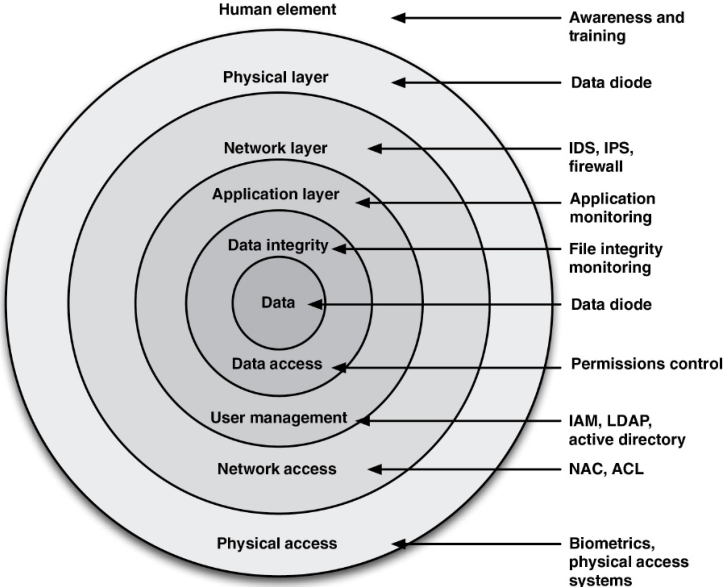

### Access Control

Most difficult, but important aspects of cyber security.
Considers 3 very important aspects of how a user interacts with resources.

* Identification
* Authentication
* Authorization

The successful implementation of access control is difficult because of the complexity of managing users and their roles and their mapping to specific devices and services that relate specifically to an employee's operational responsibilities.

The strengths of Access Control increases as a user's identity is treated with the additional context of that user's roles and responsibilities within a functional group.

## Advanced Industrial Security Recommendations

* *Security Monitoring:* Recognized method of providing situational awareness, Decide what has to be monitored
* *Policy Whitelisting:* A policy white list defines the behaviour that is acceptable. This is important in a ICS architecture, where an industrial protocol is able to exhibit specific behaviours, such as issuing commands, collecting data, or shooting down a system.
* *Application Whitelisting:* Defines the applications and files that are known to be good on a device and prevents any other application from executing.

### Common Miss perceptions About Industrial Network Security

* *Cyber security of industrial networks is not necessary:* There is no longer an air gap separating the ICS from any possible source of digital attack
* *Industrial security is an impossibility:* Even though devices in a ICS may not be patched, there are other measures to grant a intensive security
* *Cyber security is someone else's responsabilitie:* Cyber security is a end-to-end problem that requires a end-to-end solution
* *It is the same as a "regular" cyber security:* Industrial and business networks are different and require different security measures to adequately protect them.

# 3. Industrial Cyber Security History and Trends

Industrial Network systems differ from commercial network systems in that they are expected to operate for months or even years.
This is due to the network's requirements of availability.

## Importance of securing industrial networks

Before, physical security was a priority and there exists locked rooms and zones to prevent unauthorised people to enter the secure location.
Digital security wasn't a priority because the Industrial Network was air-gapped, but as more modern 'real-time' technology advanced, there needed to be a way of accessing air-tight restricted data, so it was broken.

## The evolution of the cyber threat

* *Cyber Threat:* numerous definitions exist, but all have in common

* Unauthorized access to a system
* Loss of confidentiality, integrity or availability of the system, it's data or applications

The initial penetration of industrial systems is getting easter through the evolution and deployment of increasingly complex and sophisticated malware.

The industrial systems at levels 2, 1 and 0 are being increasingly targeted.

The threats continue to evolve, learning from successful techniques from past malware while introducing new capabilities and complexity.

The industrial systems as they stand today simply don't stand a chance against a modern attack capability.
Their primary line of defense remains the business networks that surround them and network-based defenses between each security level of the network.

### Observations about the attacks

* Most attacks seem to be opportunistic
* Initial attacks, simpler exploits; Thwarted or discovered attacks, > sophisticated methods
* majority of cyber attacks -> Financially motivated
* Malware samples increase at an alarming rate
* Majority of attacks originate externally and leverage weak or stolen credentials
* Majority of incidents affecting industrial systems are unintentional
* New malware code samples are increasingly more sophisticated
* Percentage of cyber attacks is high, but has been steadily decreasing
* Auto-run malware has been rising steadily
* Malware and Hacking-as-a-service has become more prevalent
* Remote access incidents have been steadily increasing
* Pretty straightforward:
    * Spear phishing
    * Watering hole
    * Database Injection

## APT's and weaponed malware

> Advanced Persistent Threats

Stuxnet is an example of an APT and Weaponed malware
It replicated itself a number of times, and auto-removed itself from the system if it's host was no the preconfigured target.
It used 0-days to bypass IDS's and used Digital certificates (Stolen) to pretend it is a authorized program.

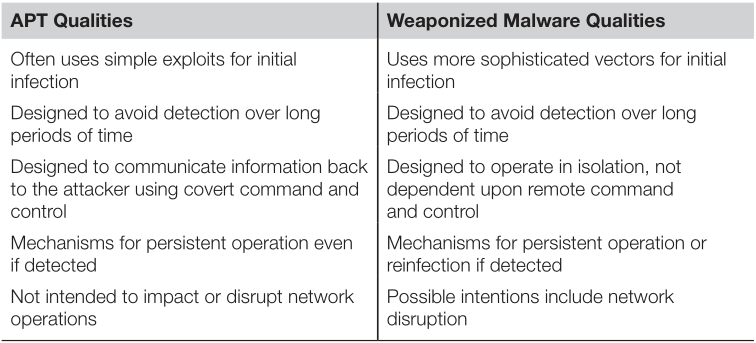

### Night Dragon

Discovered by McAfee, this weaponed malware targeted a series of Oil, Energy, and Petrochemical companies. 
The attack started with SQLi and pivoted it's way into internal network. 
They used Command and Control systems, and Remote Administration Toolkits, to recover sensitive information from the companies executives.
The goal of the attack, was to gain sensitive information.
This is a form of cyber-espionage.

### Stuxnet

Game-changer because it was the first targeted, weaponed cyber-attack against an industrial control system.

### Advanced Persistent Threats and Cyber Warfare

Important differences

* Cyber Warfare is higher in sophistication and in consequences, mostly due to available resources of the attacker and the ultimate goal of destruction versus profit.
* In many industrial networks, there is less profit available to a cyber-attacker than from others, and so it requires a different motive for attack (i.e. Socio-political)

### Defending against modern cyber-threat

Advanced Persistent Diligence requires a strong **defense-in-depth** approach, to reduce the available attack surface for a attacker and to provide a broader perspective of threat activity for use in Incident Response, Analysis, Remediation, Restoration and investigation.

Now, traditional security measures are not enough and we have to use new technologies, such as:

* **Next-generation firewalls (NGFW)**
* **Unified Threat Management (UTM)**
* **ICS protocol aware IPS's**

Having situational awareness of what is attempting to connect to the system as well as what is going on within the system is the only way to start to regain control of the network and the system connected to it.

## Insider Threats

> *Insider*: An individual who has approved access, privilege, or knowledge of information systems, information services, and missions.

This definition can be expanded to the unique operational aspect of ICS to include a wide range of individuals:

* Employees with direct access to ICS components for operation
* Employees with highly privileged access for administration and configuration
* Employees with direct access to ICS data
* Subcontractors with access to specific ICS components or subsystems for operation
* Services providers with access to specific ICS components or subsystems for support

Each of these individual can introduce unauthorised data to the system, which is, in turn focused heavily on preventing outside attack

The Repository of Industrial Security Incidents (RISI) showed in 2013 that only 35% of incidents originated from outsiders.
The reason is not a intentional will of causing harm to a system, but a result of unintentional or accidental actions directed on the overall security policies deployed within the architecture.

## Hacktivism, Cyber Crime, Cyber Terrorism, and Cyber War

There are vulnerable industrial systems, and because these systems are vulnerable, anyone willing to perform some research, download some freely available tools, and put forth some effort, can launch an attack. 
With a minimal knowledge of ICS, the likelihood of a successful attack with moderate consequences is significantly increased.
The real question is one of motive and resources.
The average person is not motivated enough, a hacktivist group is.
The average person nay not have the resources to develop a 0-day exploit or execute spear-phishing campaigns, but now, all of these services, are available for hire.
A fully weaponed attack on a critical infrastructure, no longer needs to be military, because it can be mercenary.

# 4. Industrial Control System and Operations

## System Assets

We have to understand the type of devices that are connected to the network:

* Sensors, Actuators, Motor, Drives, Gauges
* Programmable Logic Controllers (PLC)
* Remote Terminal Units (RTU)
* Intelligent Electronic Device
* Human-Machine Interface
* Supervisory Workstation
* Data Historian
* And others

### Programmable Logic Controller

* used to automate functions within manufacturing facilities.
* Typically hardened 
* specialized for a specific use
* Custom OS, with as little overhead as possible
* Typically control real-time processes

#### Ladder Diagrams (LD) 

Is a simplistic programming language included with the IEC-61131-3 standard.
Can be thought of as a set of connections between inputs (relay contacts) and outputs (relay coils)
Ladder logic follows a relay function diagram. 
A path is traced from the left hand side, across "rungs" consisting of various inputs. 
If a input relay is true, the path continues.
If the path to the right side completes, the output coil will be set to true.
Every step is tested in each scan

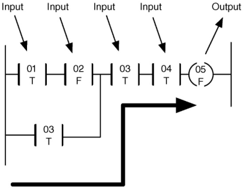

### Sequential Function Charts

*Sequential Logic:* Programming language used by PLC's and defined within the IEC-61131-3 standard 

* Sequential Logic Differs from ladder logic in that each step is executed in isolation and progresses to the next step only upon completion.
* Very common in batch-oriented operations
* Can be uploaded the logic by direct serial or ethernet
* PLC's can hold the code and the compiled logic

### Remote Terminal Unit

* Typically reside in a substation, along a pipeline or some other remote location
* Monitor field parameters and transmit the data back to the central monitoring station
* Commonly include a Modem, cellular data connection, radio or other wide area communication technology
* Typically stored in locations with no access to electricity and may be supplied with it by solar panels
* Commonly placed outdoors, subdued to extreme environmental conditions
* RTU's and PLC continue to overlap, to the point that a RCU can be thought of as a remote PLC

### Intelligent Electronic Devices

* Electric Utility Sector's take on RTU's.
* They manage electrical loads and provide local isolation when needed.
* They can also be installed in areas with high voltage and weather, such as a tower.

### Human Machine Interface

* Used as an operator's means to interact with PLC's, RTU's and IED's.
* Replace manually activated switches, dials and controls used to sense and influence the process.
* Come in two predominant form-factors
    * Runs on Modern OS and are capable of performing a variety of functions
    * Combine a Industrial Hardened computer, local touch panel and is packaged to support door on direct panel mounting. Typically use embedded OS and are programmed with a separate computer and associated engineering software.
* Used without password, because in a event of a emergency, using a password is unsafe.

### Supervisory Workstations

* Collects information from assets used within a control system and presents that information for supervisory purposes.
* Is primary read-only
* Change parameters such as alarm limits for a process

### Data Historian

* Specialized software that collects point values, alarm events, batch records, and systems and stores it in a purpose-built database.
* Data histories and stored within a historian is referred to as "tags" and can represent almost anything. ( From airflow in a vent to acceptable loss margins) 

Information used by both industrial operations and business management is often replicated across industrial and business networks. This represents a security risk, as a less secure network, such as a business network can provide access to a more secure zone. 

Properly isolating and securing data historian components that connect with assets in less trusted networks within a semi trusted DMZ significantly help to minimize accessibility.

### Business Information Consoles and Dashboards

Consist of the same data presented to a HMI or data historian system, but physically located elsewhere, such as a executive office. 
The physical display in this case, is controlled using a secure keyboard video mouse switching system (KVM)
It can also be presented, using intermediary steps, to a website inside a company's Intranet, or a excel sheet. Depending on the complexity of the BICAD's

## System Operations

A typical industrial operation consists of  several layers of programmed logic designed to manipulate mechanical controls in  order to automate the operation.
Each specific function is automated by what is com- only referred to as a control loop.
Multiple control loops are typically combined or  stacked together to automate larger processes

### Control Loops

One of the many automated processes that make up a Industrial Controller.
The term loop, derives of the ladder-logic widely used in these systems.
A closed loop is one in which its output, affects its input.
Closed loops provide automated control, open loops, provide manual control.

### Control Processes

General term used to define larger automated processes within an industrial operation.
One control process may be composed of one or more control loops.
Each process is typically managed using a HMI, which is used to interact with the process.

### Feedback loops

Feedback is generally provided directly from the HMI used to control a specific process.

### Production Information Management

Once histories, the information can be further analyzed using tools, such as Statistical Process Control (SPC) / Statistical Quality Control (SQC), either directly from within the data historian or by using an external analysis tool, such as a spreadsheet.
Historical data can be replayed at some point in the future to compare past and present plant operations.

### Business Information Management

Operational monitoring and analysis provides valuable information that can be used by plant management to fine-tune operations, improve efficiencies, minimize costs, and maximize profits.
This drives a need for replication of operational data into the business network.
By placing an HMI outside of the ICS DMZ, any firewalls, IDS/IPS, and other security monitoring devices that are in place need to be configured to allow the communication of the HMI into and out of the ICS DMZ.
This effectively reduces the strength of the security perimeter between the industrial and business networks to user authentication only.

## Process Management

An HMI is used by an operator to obtain real-time information about the state of the process to determine whether manual intervention is required to manage the control process by adjusting an output (open loop) or modifying established set points (closed loop).

## Safety Instrumented Systems

Safety instrumented systems (SIS) are deployed as part of a comprehensive risk management strategy utilizing layers of protection to prevent a manufacturing environment from reaching an unsafe operating condition.
The Basic Process Control System is in charge of maintaining a discrete and continuous control of the process, but I case the process reaches extreme, unstable states, the Safety Instrumented System is deployed. 
This typically manages a automated shutdown of the process.

There are two risks originate within the SIS related to cyber incidents:

* The prevention of the SIS from properly performing its control functions can allow the plant to transition into a dangerous state that could result in catastrophic events.
* The SIS can also be used maliciously to cause unintentional equipment or plant shutdowns

In both cases, the need to isolate the SIS  to the greatest extent is a reasonable approach to improving cyber security resilience.
The systems have to be checked periodically to ensure they work. 
This is a good time to perform security operations such as SW updates and patching.

## The smart grid

The smart grid is complex and highly interconnected. 
It is not the convergence of a few systems, but of many including customer information systems, billing systems or demand response systems.
Most of these systems interconnect and intercommunicate with many others.
The benefits of this allow for intelligent command and control of energy usage, distribution, and billing.
The disadvantage of such a system is that the same end-to-end command and control pathways could be exploited to attack one, any, or all of the connected systems.

## Network Architectures

The ICSs and operations discussed so far are typically limited to specific areas of a larger network design, which at a very high level consist of business networks, production networks, and control networks.  

In reality, industrial networks consist of multiple networks, and they are rarely so easily and neatly organized.

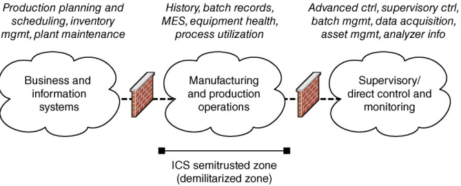

# 5. Industrial Network Design and Architecture

There are many functions to be served in an industrial network in addition to the control system, along with consideration for many distinct network areas.
The supervisory components that oversee these basic controls systems are interconnected via a network of specialized embedded systems, workstations, and various types of servers.
Many supervisory networks may constitute a larger plant network.
In addition, the business network cannot be forsaken here.
Each area, depending upon it's function, capacity, system vendor, and owner/operator well have it's own topologies, performance considerations, remote access requirements and network services.
These must all be taken into account when considering one of the most important security design considerations.
Network segmentation.

> In ICS, network segmentation is most used in terms of *zone segmentation*.
Zone segmentation refers to the division of industrial systems into grouped subsystems, for the primary purpose of reducing the attack surface of a given system, as well as minimizing attack vectors into and out of that system.
This is accomplished by limiting the unnecessary flow of data between zones.

**A security zone is focused on the grouping of assets based purely on security requirements.**

## Introduction to industrial networking

In an industrial network, the availability of data is often prioritized over data integrity and confidentiality. 
As a result, there is a greater use of UDP protocols and fault-tolerant networks interconnecting endpoints and servers.
Bandwidth and latency are extremely important, as the applications and protocols in use support real-time operations that depend on deterministic communication, often with precise timing requirements.

## Common topologies

* **Bus topologies:** Linear, often used to support either serially connected devices, or multiple devices connected to a common bus via taps. Inexpensive, but limited in performance and reliability. Not very widely used.
* **Mesh topologies:** Used for critical devices that require performance and uptime. (Core ethernet switches, routers and servers). Many paths exist to a given point (redundant)
* **Wireless mesh:** Logically similar to wired mesh topologies.
* **Star topologies:** Point-to-multipoint networks. A centralized network resource supports many nodes or devices.
* **Branch/tree topologies:** Hierarchically connected topologies where a single topology (trunk) supports additional topologies (branches)
* **Ring topologies:** Each node connected serially, but the end node is connected to the first also. Normally used to interconnect network access switches
* **Multihoming or Dual-Homing:** Connection of a single node to > 1 networks. 

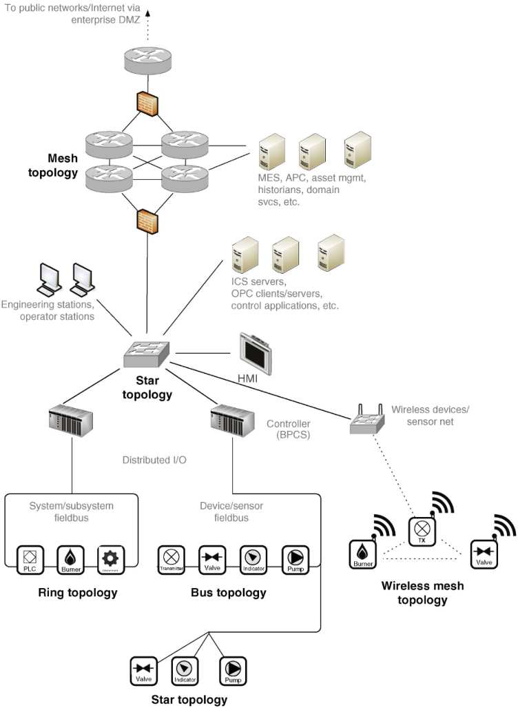

## Network Segmentation

Originally developed as a means to limit the broadcast domain of an Ethernet network that was designed at that time around 10MB connections typically using either a "hub" (10BaseT) or a shared "trunk" (10Base2) as an access medium.
**Segmentation typically occours at layer 3 (network layer), by a network device providing routing functions (routers, firewalls, switches)** but as networks became larger due to switched Ethernet technology becoming commodities and capabilities of network processing increased providing an alternative method of segmentation.
This relatively new development allowed broadcast to be contained at layer 2 using virtual LANs (VLANs), which utilize a tag in the Ethernet header to establish a VLAN ID (802.1Q). 
VLANs enable compatible Ethernet switches to forward or deny traffic (including broadcasts) based upon either the 802.1Q tag or the port’s VLAN ID (PVID).
To communicate between VLANs, traffic would need to be explicitly routed between VLANs at Layer 3, using a routing device.
Essentially, each VLAN behaved as if it were connected to a dedicated subinterface on the router, only the segmentation occurred at Layer 2, separating the function from the main physical router interface.
This meant that VLANs could segment traffic much more flexibly, and much more cost effectively as it minimized the amount of routers that needed to be deployed.

Today there are Layer 3 switches that combine the benefits of a VLAN switch with the added control of a layer 4 router, making VLANs much easier to implement and maintain.

* *Segmentation:* Division of networks or zones into smaller units. Segmented networks still intercommunicate over a common infrastructure
* *Segregation:* Elimination of communication or data flow in order to completely isolate systems.

Examples of network segmentation:

* Public networks (Internet)
* Business networks
* Operation networks
* Plant control networks
* Supervisory control networks (ICS, engineering workstations, and HMIs)
* Basic/Local control networks (Controllers, PLC's, RTU's, field devices, IED's and subsystems)
* Process networks (Device networks, analyzer networks, equipment monitoring networks and automation systems)
* Safety networks (safety instrumented systems (SIS) and devices)

Depending upon how the network infrastructure is configured, the division of the network can be: Absolute, Conditional, Bidirectional, Unidirectional.

## Higher layer segmentation

Normally, network segmentation is enforced at layer 2 (VLANs) or 3 (subnets).
The containment of certain network activities can be implemented in any layer of the OSI model.
By limiting sessions and applications at OSI layer 4-7 instead of layers 2-3, it becomes possible to isolate certain communications between fully defined groups of devices, while allowing other communications to operate more freely.

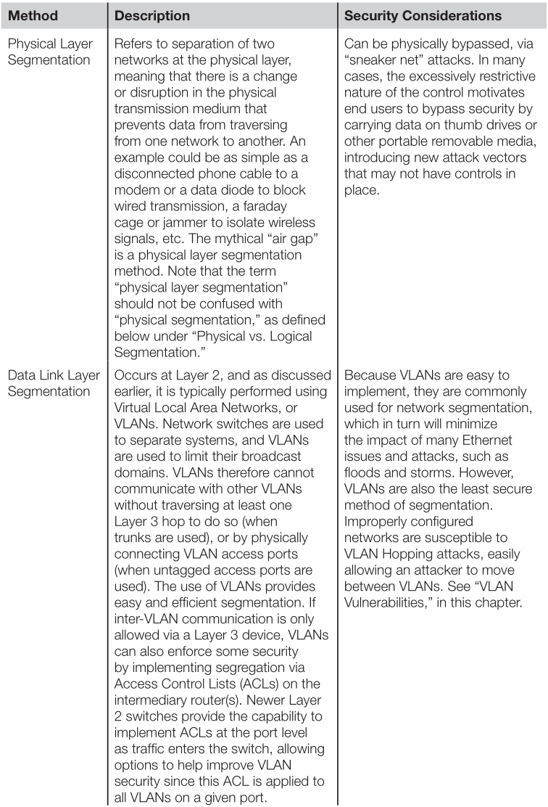

### At what layer should security be implemented?

Risk and vulnerability assessments would help answer the dilemma.

1. Protect areas that represent the greatest risk first

### Relative benefits of various network segmentation methods

### Physical vs logical segmentation

* *Physical segmentation:* use of two separate physical network devices to perform the isolation between networks
* *Logical segmentation:* Use of logical functions within a single network to achieve the same result

Proper network segmentation is important for both process and control networks that often utilize UDP multicast to communicate between process devices with the least amount of latency.
Layer 2 network segmentation within a common process may be impossible because it would break up the required multicast domain.
Communication between control networks and process networks are handled at a higher tier of the overall architecture using layer 3 switching or routing.

Logical segmentation is only allowed between those segments/zones that require minimal security against cyber-threats. To address this risk:

* Implement defense-in-depth security controls at the demarcation points where networks can be segmented.
* Monitor process network activity

## Network services

When managing multiple networks (Ranging from business to industrial), Domain servers and other identity and access control systems should be maintained separately for the industrial network.

When providing for network network services in industrial systems, abide by the *Principle of least route* which states that in a purpose-built network, a node should only be given the connectivity to perform it's function. (a node must only posses the minimum level of network access that is required for it's individual function)

## Wireless Networks

Any device that is equipped with an appropriate receiver or transmitter and is within the range of an access point can physically receive or transmit wireless signals.

Industrial networks that implement outdoor wireless networks typically conduct thorough radio frequency surveys in order to place antennas in optimized positions and reduce unnecessary exposure to the network. 

In industrial networks, wireless communication is achieved with two implementations:

* *WirelassHART:* Wireless implementation of the HART protocol using IEEE 802.15.4 radio and TDMA communication between nodes
* *OneWireless:* Implementation of ISA 100.11a wireless mesh network based on IEEE 802.11 a/b/g/n standards and is used to transport common industrial protocols such as:
    * Modbus
    * HART
    * OPC
    * General Client Interface (GCI)
    * And other vendor-specific protocols

Both systems support mesh networks and use 2 devices: One for managing connected nodes and communications between nodes, and one to enforce access control and security.

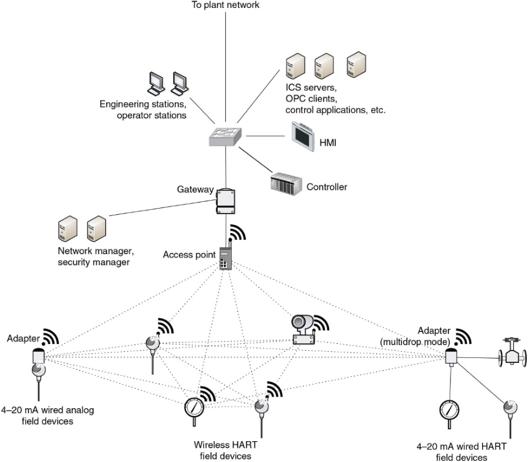

## Remote access

Necessary evil that must be considered when designing the network. (Incident response and resolution, remote access to engineers for difficult access locations)
All access points should be considered an attack vector and therefore used only when necessary.

Strict security controls should be used:

* *Minimize attack vectors:* Provide one path over which remote access may occur when implementing a remote access solution.
* *Follow the principle of leas privilege:* Users only access systems or devices with which they have specific need or authority
* *segmentation and segregation:* to isolate the systems that allow remote access from other systems not accessed remotely
* *Application control:* to limit remote users to only those applications with which they are authorized.
* *Prevent direct access to critical system:* where the risk outweighs the benefits of remote access. Force remote access through a DMZ or proxy, to enforce further security measures.
* *Remote connection security policy should be >= to the physical connection policy:* Preferred approach is to create a *jump station*, which provides a landing point for the user before he connects to the physical trusted device.
* *Avoid storing credentials on the remote end of the connection:* even if then are transmitted via secure tunnel.
* *Ability to terminate and disconnect remote access mechanisms localy:* in the event of a cyber incident
* *Log everything:* All successful and unsuccessful remote access and activity.

### Performance and considerations

#### Latency and jitter

* *Latency:* The time it takes for a packet to traverse a network from it's source to it's destination host.
* *Jitter:* Variability of latency over time as large amounts of data are transmitted across the network.

#### Bandwidth and throughput

* *Bandwidth:* The total amount of data that can be carried from one point to another in a given period of time. (Typically measured in Mbps or Gbps)
  * Is not usually a concern in IN although it may occur in large flat (layer 2) networks (noisy)
* *Throughput:* volume of data that can flow through a network.
  * The correlation between bandwidth and throughput is dependent on the size of the packet.
  * A device is said to have *line rate* throughput when it can transfer data at the full capability of the network interface.

#### Types of service, class of service, and quality of service

* *Quality of Service (QoS):* the ability to differentiate and prioritize some traffic over other traffic.
* *Type of Service (ToS) and Class of Service (CoS):* provide the mechanisms for identifying the different types of traffic.
    * CoS is identified at a layer 2  using the 802.1p protocol (Provides a field in the header to differentiate)
    * ToS is identified in a layer 3 using the 6-bit ToS field in the IPv4 header.

Both ToS and CoS values are used by QoS mechanisms to shape the overall network traffic.

#### Network hops

Every network device the packet encounters must process the packet.
This adds latency, although most modern network devices are very high performance, and no not add much latency.
Routers and some security devices that operate at layer 4-7 may incur measurable amounts of latency.

#### Network security controls

Introduce latency to a greater degree than network switches and routers.
The deeper the inspection, the greater the imposed latency.

### Safety instrumented systems (SIS)

Consists of many of the same types of devices as a ICS.
Functionally, the SIS is intended to detect a potentially hazardous state of operation, and place the system into a "safe state" before the hazardous state can occur.
Designed for maximum reliability and include redundancy and self-diagnostics to ensure the SIS is fully functional.
This requirement is measured as a statistical value called the *Average Probability of Failure on Demand* (PFD).
This probability is stated as a Safety Integrity Level (SIL) ranging from 1 (PFD of < 10 ^-1)to 4 (PFD of < 10 ^-4)

While SIS cannot protect against cyber attacks directly, they should be able to prevent catastrophe from being caused by a cyber-attack against an industrial process by putting the system into a secure state before the catastrophe can occur.
General advice:

* When implementing a SIS, do so in a way that a malicious actor who successfully compromises control and process zones will not be able to compromise the SIS.
* Comply with the Principle of Least Privilege
* Consider failures and unsafe states when implementing an SIS

### Special considerations

As systems are tuned to specific purposes -such as the advanced metering requirements for the smart grid- specialized networks such as the advanced metering infrastructure (AMI), will evolve to accommodate them.
It is important to give specialized system their due consideration while continuing to apply the fundamental principles of secure network design.

#### Wide area connectivity

Can be provided by private infrastructure or by leased connectivity from public carriers.
These connections should therefore be considered higher risk, and extra measures should be taken to ensure confidentiality, integrity, and availability of a WAN connection.

#### Smart grid network considerations

There is one primary quality that is consistent across any smart grid deployment, and that is the scale and accessibility.
The scale of the smart grid requires the use of some mechanisms to "tier" or hierarchically distribute the nodes.

Scalability also plays a role in the development of smart grid devices, putting significant cost pressure on the end-node devices (smart meters).
Ant device used at such a large scale needs to be as efficient to build, deploy, operate, and maintain as possible.
This business driver is a real concern because of the costs ans complexity of providing security assurances and testing throughput the supply, design, and manufacturing stages of smart meter development.

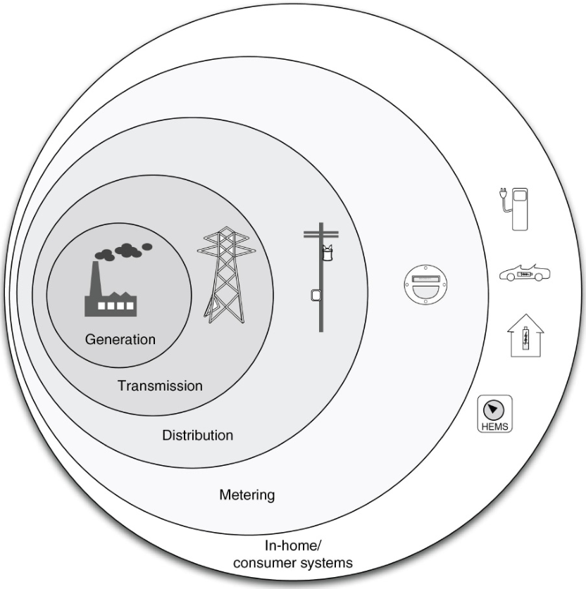

#### Advanced metering infrastructure

Are used by electric, water and gas utilities.
Highly Distributed, Massively scalable, uses specialized systems and protocols, presents a number of security and privacy considerations, and extremely accessible.

Advanced metering infrastructure architecture consists of smart meters, a communication network, and a AMI server or headend. 

* Smart meter: digital device for real time data collection, a microprocessor and a local memory, and a network interface to connect to the headend.
* Headend: AMI server (Collection of metered data), Meter Data Management System (MDMS) (shares with billing systems, historians). Intercommunicates with many other systems in the smart grid (Transmission and distribution ICS servers, energy management systems (EMS), in home networks and many others).
* The potential for exploitability is big, given the business requirements, low cost, and number of devices. Also it's proprietary protocols.

# 6. Industrial Network Protocols

Industrial Protocols are designed for real-time operation to support precision operations involving deterministic communication of both monitoring and control data.
This means that most industrial protocols forgo any feature (Authentication / encryption) or function that is not absolutely necessary for the sake of efficiency.
Many of these protocols have been modified to run over Ethernet and Internet Protocol (IP) networks as suppliers moved away from proprietary networks.

## Overview of industrial network protocols

> Real-time communications protocols, developed to interconnect the systems, interfaces, and instruments that make up an industrial control system. 

Will be divided into:

* Fieldbus protocols
    * FOUNDATION Fieldbus, CIP, PROFIBUS/PROFINET, P-NET, WorldFIP, INTERBUS, CC-Link, HART, SERCOS
    * Commonly used to connect process-connected devices (e.g. Sensors) to basic control devices (e.g. PLC), and control devices to supervisory systems (e.g. ICS server, HMI, historian)
* Backend protocols
    * Deployed on or above supervisory networks, and are used to provide efficient system-to-system communication as opposed to data access.
    * Commonly used to connect a historian to an ICS server, connecting a ICS from one supplier to another supplier's systems, or connecting two ICS operation control centers.

The most important protocols:

* **Fieldbus**:
    * Modicon Communication Bus (Modbus)
    * Distributed Network Protocol (DNP)
* **Backend**:
    * Open Process Communications (OPC)
    * Inter-Control Center Protocol (ICCP)

Because they represent some unique qualities:

* Each is used in different areas within an industrial network
* Each provides different methods of verifying data integrity and/or security
* The specialized requirements of Industrial Network (Rea-time synchronous communication) often make them highly susceptible to disruption

### Fieldbus Protocols

#### Modicon Communications bus

Designed in 1979 to enable process controllers to communicate with real-time computers, and remains one of the most popular protocols used in ICS architectures.

##### What it does:

Operates at layer 7 of the OSI model.
Extremely simple devices, such as sensors or motors, use Modbus to communicate with more complex computers

##### How it works:

Request/response protocol using 3 distinct protocol data units (PDU):

* Modbus Request 
* Modbus Response
* Modbus Exception Response

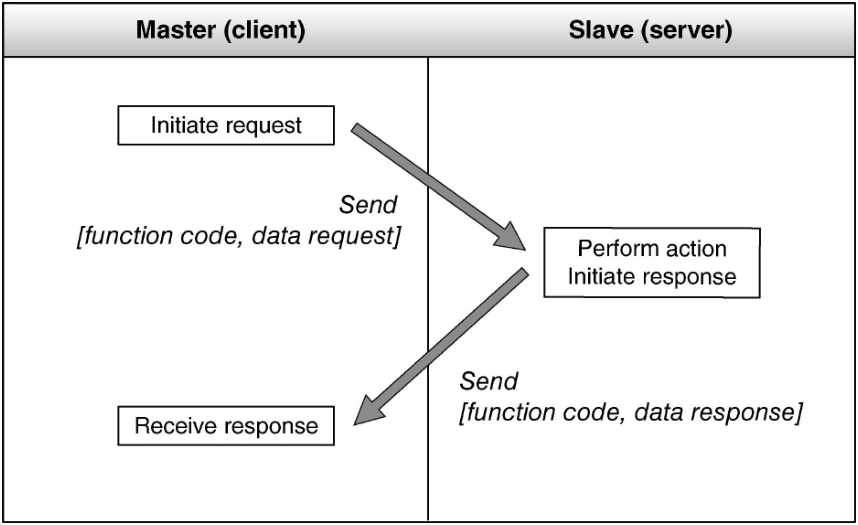

Function codes and data requests can be used to perform a wide range of commands:

* Read the value of a single register
* Write the value of a single register
* Read a block of values from a group of registers
* Write a block of values from a group of registers
* Read files
* Write files
* Obtain device diagnostic data

##### Variants:

* Mobdus RTU and Modbus ASCII

> Variants of Modbus made to work in asynchronous serial communications.

> * Modbus RTU: Supports Binary
* ModbusASCII: Supports ASCII (X2 the size of Modbus RTU (Due to Hex encoding vs Binary))

* Modbus TCP: 

> * Modbus TCP: Supports IP

> Come in two forms, the *basic* form takes the original protocol and applies a Modbus Application Protocol (MBAP) to create a new frame. Common with old, legacy HW.
ModbusTCP is the more common and removes the legacy address and error checking and uses only the Modbus PDU with a MBAP header.

* Modbus Plus or Modbus+: 

> Uses token passing mechanisms to send embedded Modbus messages

##### Where is is used:

Typically deployed between PLC's (slave) and HMI's (Master), or between a master PLC and several slave devices.

##### Security concerns:

* Lack of authentication - Only require the use of valid Modbus address, function code, and associated data.
* Lack of encryption - Commands and address are transmitted in clear text
* Lack of message checksum (Modbus/TCP only) - Command can easily be spoofed
* Lack of broadcast suppression - All serially connected devices will receive all messages

##### Security recommendations:

* Should be used to communicate within a set of known devices
* Provide access control with filtering capabilities and filter:
    * Modbus TCP packets are the wrong size
    * Function codes that force devices into a "listen only" mode
    * Function codes that restart communications
    * Function codes clear, erase or reset diagnostic information, such as counters and diagnostic registers
    * Function codes that request information about Modbus server
    * Any message with an Exception code PDU
    * Modbus traffic from a server to many slaves
    * Modbus requests for lists of defined ports and their values (Conf scan)
    * Commands to list all available function codes (Conf scan)

#### Distributed network protocol (DNP / DNP3)

Serial protocol designed for use between master stations and slave devices (Outstations).
The primary motivation for this protocol is to provide reliable communication in environments common with the electric utility industry that include high levels of electromagnetic frequency and poor transmission media.
Extended to work over TCP/IP.
Now used by electric, oil, gas, water and wastewater industries.
Unlike Modbus and ICCP, DNP3 is bidirectional (Supporting communications from master to slave and from slave to master) and supports exception-based reporting

##### What it does:

Used to send and receive messages between control system devices.
The link-layer frame ( or LPDU) header and the data payload contain CRC's and the data payload actually contains a pair of CRC octets for every 16 data octets. 
This provides a high degree of assurance that any communication errors will be detected.
It is still possible to loose a packet
Each frame consists of a multi-part header and a data payload.
The frame header contains well-defined function code, which can tell the recipient whether it should confirm, read, write, select a specific point, operate a point, and more.
The data payload of the frame support analog data, binary data, files, counters and other types of data objects.

##### How it works:

DNP3 provides a method to identify the remote device's parameters and then use message buffers corresponding to event data classes 1 - 3 in order to identify incoming messages and compare them to known point data.
In this way the paster station is only required to retrieve new information resulting from a point change or changes event on the outstation.

When a change occurs on an outstation, a flag is set to the appropriate data class.
The master station is then able to poll only those outstations where there is new information to be reported.
This directly results in improved responsiveness and more efficient data exchange.

##### Secure DNP3:

Adds authentication to the response/request process
Authentication occurs using a unique session key that is hashed together with message data from the sender and from the challenger.
The result is an authentication method that verifies authority, integrity, and pairing at the same time.

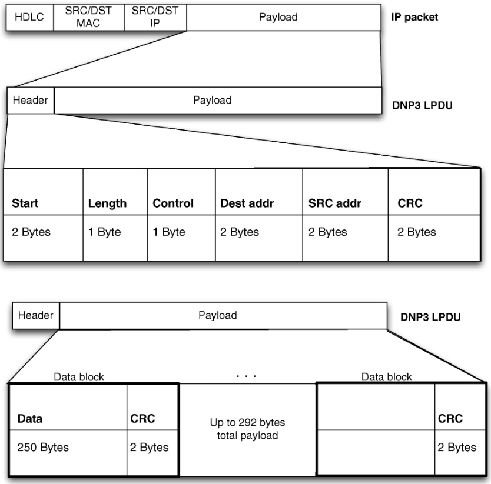

##### Where is is used:

Between a master control station and a RTU in a remote station.
Transmission medium can include wireless, ratio and dial-up.
Also widely used to interconnect RTU and IED.

##### Security concerns:

No inherent authentication or encryption within DNP3.
Examples of manipulations:

* Turning off unsolicited reporting to suppress alarms
* Spoofing unsolicited responses to the master, to trick the operator into performing inappropriate actions.
* Issuing unauthorised stops, restarts, or other functions that could disrupt operations

##### Security recommendations:

Implement only secure DNP3 or TLS if not possible.
DNP3 stations and outstations should be isolated into a unique zone consisting only of authorized devices and the zones should be thoroughly secured using standard defense-in-depth best practices, including a industrial firewall.
Look for, and decline access with specific function calls and behaviours:

* Use of any non-DNP3 communication on a DNP3 port
* Use of configuration function 23 (Disable unsolicited response)
* Use of control function codes 4, 5 or 6 (Operate, Direct Operate, and Direct Operate without Acknowledgement)
* Use of application control function 18 (Stop Application)
* Multiple unsolicited responses over time (Response storm)
* Any unauthorised attempt to perform an action requiring authentication
* Any Authentication failures

#### Process fieldbus

Most used variant is PROFIBUS DP, which has 3 variants PROFIBUS DP-V{0..2}.
There are also three profiles for PROFIBUS communication: asynchronous, synchronous and over Ethernet (PROFINET).
PROFIBUS is a master-slave protocol that supports multiple master nodes through the use of token sharing (When a master has control of the token, it can communicate with the slaves)
A master PROFIBUS node is typically a PLC or RTU, and a slave is a sensor, motor, or some other control system device.

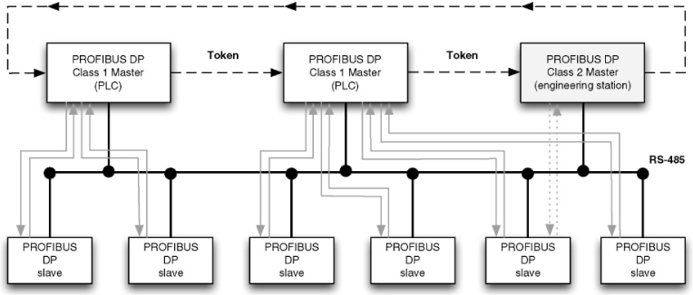

##### Security concerns:

PROFIBUS lacks authentication inherent to many of its functions, allowing a spoofed node to impersonate a master node, which in turn provides control over all configured slaves.
(PROFIBUS DP utilizes DP network, therefore, the attacker has to physically there. This reduces the attack options)

##### Security recommendations:

The network and connected devices are very susceptible of attack if unauthorised physical access is obtained.

### Industrial ethernet protocols

Term used to reference the adaptation of the IEEE 802.3 Ethernet standard to real-time industrial automation applications.
One of the goals was to go from a asynchronous standard to a synchronous one.
Industrial Ethernet also provides physical enhancements to "harden" the office grade nature of standard Ethernet technologies with ruggedized wiring, connectors and hardware designed for industrial use.

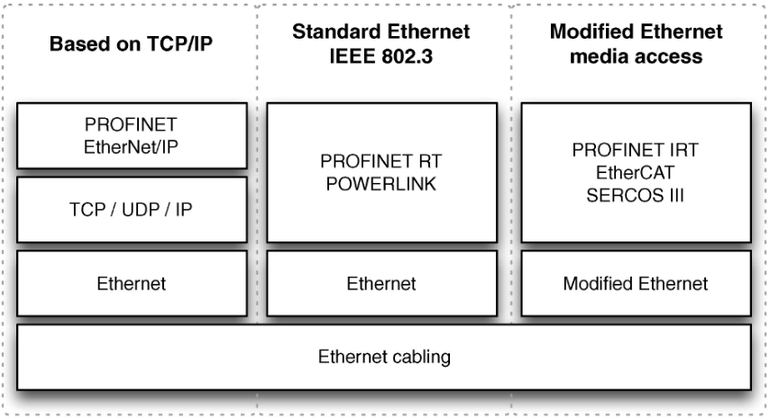

#### Ethernet Industrial Protocol:

CIP, also known as Control and Information Protocol, is a publicly available protocol managed through the Open Device Vendors Association (ODVA).
CIP is an application layer protocol that provides a consistent set of messages and services that can be implemented in a variety of ways using different network and link layer techniques, all supporting interoperability.
CIP supports integration of I/O, control, data collection, and device configuration on a single network.

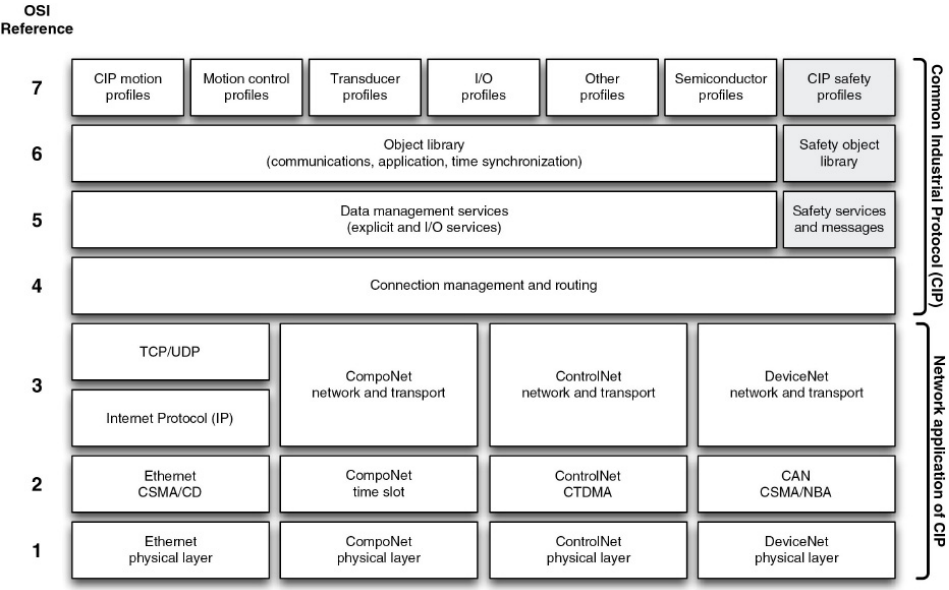

EtherNet/IP uses standard Ethernet frames in conjunction with the CIP suite to communicate with nodes.
EIP supports everything CIP implements.

CIP uses object models to define the various qualities of a device.
Each CIP object possesses attributes (data), services (commands), connections, and behaviours (relationships between attributes, values and services)
There are 3 types of objects:

* Required objects

> Define attributes such as device identifiers (Manufacturer, serial number, date of manufacture) (Identity object), routing identifiers, and physical connection data.

* Application objects

> Define input and output profiles for devices

* vendor-specific Objects

> Enable vendors to add proprietary objects to a device

The wide adaptation and standardization of CIP has resulted in an extensive library of device models which can facilitate interoperability, but can also aid in control network scanning and enumeration.

##### Security concerns:

* Susceptible to any of the vulnerabilities of Ethernet.
* The CIP does not define any implicit or explicit mechanisms for security
* Use of common device objects can facilitate device identification and enumeration

##### Security recommendations:

* Real-time ethernet protocol using TCP and UDP transports making it necessary to provide Ethernet and IP-based security at the perimeter of any EIP network.
* Consideration to put EIP devices inside a dedicated zone with packet monitoring.

#### PROFINET:

Designed for scalability.
3 versions.

> 1 - built on top of TCP/IP
2 - RT technology bypasses OSI layers 3 and 4
3 - requires specific hardware, and is a OSI layer 2.

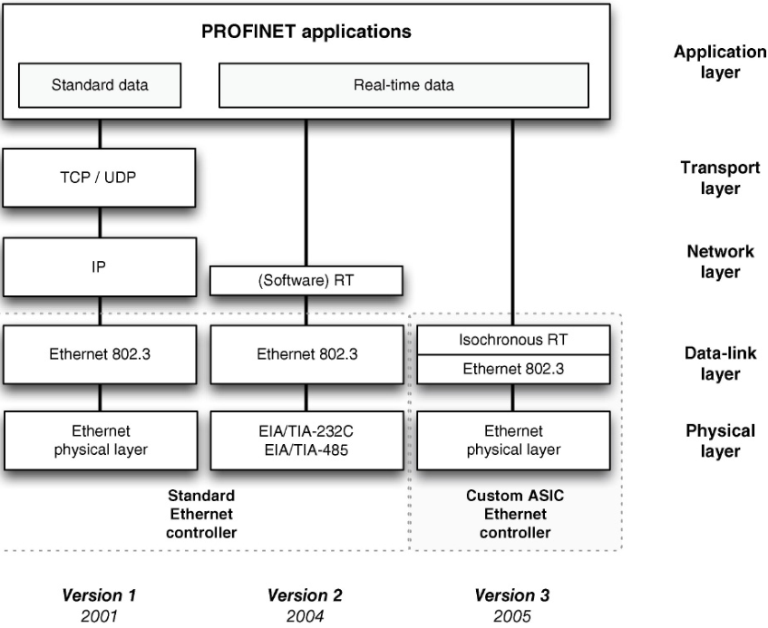

##### Security concerns:

Real-time Ethernet protocol, therefore is susceptible to any of the vulnerabilities of Ethernet.

##### Security recommendations:

* Lack of authentication protocols requires strong isolation of the bus.
* Careful consideration of the zones and conduits.
* Monitoring of the network: Firewalls, ICS-aware IPS's. 

#### Ether cat:

Real-time Ethernet-based fieldbus protocol classified as "Industrial Ethernet"
Can be used directly in a Ethernet frame or encapsulated as a UDP payload over port 34980.
Only 1-2 Ethernet frames are required for a complete cycle, allowing for very short cycle times. (Meeting IEEE Precision Time Protocol (PTP) requirements without specific HW)

##### Security concerns:

* Susceptible to any vulnerabilities found in standard Ethernet.
* No inherent network-layer mechanism for reliability, ordering, or data integrity checks.
* Susceptible to DoS, and MitM attacks.

##### Security recommendations:

* Provide Ethernet-based security at the perimeter of the network
* Use passive network monitoring
* ICS-aware IPS

#### Ethernet Power link:

* Fast Ethernet as the basis for real-time transmission of control messages via direct encapsulation of ethernet frames.
* Communication is divided into 3 time periods:
    * Transmission of a Master "Start of cycle" frame
    * Slave response if received a poll request frame
    * Asynchronous communication

##### Security concerns:

* Susceptible to any vulnerability of Ethernet communication
* Susceptible to DoS attacks

##### Security recommendations:

* Clear demarcation, based on the cyclic polling mechanism.
* Static Ethernet address tables
* Establish appropriate security zones

#### SERCOS III:

> Serial Real-time Communication System is a standardized open digital interface for communication between industrial controls, motion devices, and I/O devices. 

* Version 3 is a "Industrial Ethernet"-based implementation of the SERCOS interface that supports deterministic real-time control of motion and I/O applications.
* Master - slave protocol that operates cyclically

##### Security concerns:

* Susceptible to any of the vulnerabilities of other forms of Ethernet communication.
* Introduces new security concerns through the option to perform embedded TCP or UDP communications.

##### Security recommendations:

* Deploy static Ethernet-based tables 
* IP channel should be restricted or avoided
* Strong perimeter defenses
* Active monitoring

### Backend Protocols

#### Open Process Communications:

OLE (Object Linking and Embedded) for Process Control is not an Industrial Protocol, but "a series of standard specifications" designed to simplify integrations of various forms of data on the systems from different vendors.
Most embedded systems don't use Microsoft technology, but until the creation of OPC, they had to.
This protocol enhances the communication model, and adds better security.

##### What it does:

Designed to provide a higher level of integration between systems and subsystems, vs a fieldbus, that generally provides low-level data access and configuration.
OPC was motivated by the needs of end "users" and not system "vendors" to provide a common communication interface between diverse ICS components.

##### How it works:

Client-server manner, a client application calls a local process, bot instead of executing the process using local code, the process is executed on a remote server.
The remote process is linked to the client application and is responsible for providing the necessary parameters and functions to the server, utilizing a remote procedure call (RPC)

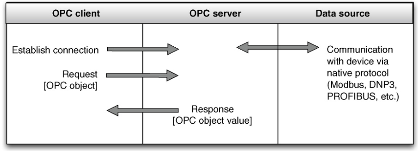

OPC makes it difficult for Industrial Networks, because it has de ability to change ports.

##### Where is is used:

Commonly used within industrial networks, including data transfers to historians, data connection within HMI's, connectivity between serial fieldbus protocols like Modbus and DNP3 and ICS servers and other supervisory controls.

##### Security concerns:

* Highly vulnerable to attack using multiple vectors as it is subject to the same vulnerabilities as the more ubiquitously used OLE.
* Difficult to upgrade
* RPC vulnerabilities - OPC uses RPC making it susceptible to all RPC-related vulnerabilities
* Unnecessary ports and services
* OPC server integrity - Can create a rogue server and use to disrupt service and DoS.

##### Security recommendations:

* Use OPC-UA when possible
* All unnecessary ports and services should be removed from the OPC server
* OPC servers should be isolated into a unique zone consisting only of authorized devices
* Secure zones with Defense-in-depth practices
* Use Firewalls

#### Inter-control center Communications Protocol (ICCP):

Designed for communication between control centers within the electric utility industry.
Designed for bidirectional Wide Area Network (WAN) communication between a utility control center and other control centers, power plants, substations, and even other utilities.
A common protocol was needed to allow for reliable and standardized data exchange between utility control centers. 
Especially when the control centers are operated by different owners.

##### What it does:

* Establishes a connection
* Accesses information (read requests)
* Information transmission
* Notification of changes / alarms and other exceptional conditions
* Configuration of remote devices
* Control of operating programs

##### How it works:

Client-server model.
One control center is the client and another, the server.
ICCP is a unidirectional protocol, but most implementations, support both functions, allowing a single ICCP device to function as both client and server

##### Where is is used:

* Widely used between control system zones and between distinct control centers.

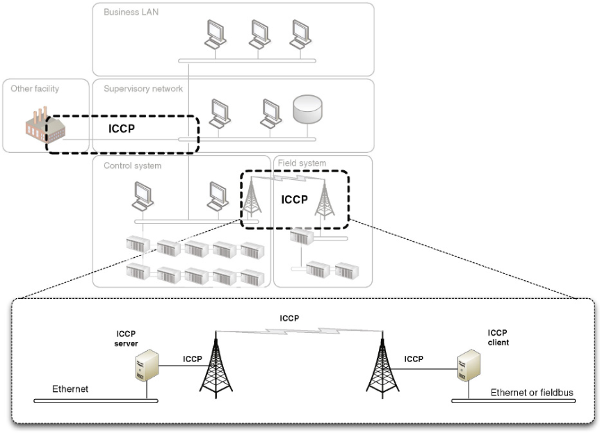

##### Security concerns:

Susceptible to spoofing and session hijacking because of:

* Lack of authentication and encryption
* Explicitly defined trust relationships

##### Security improvements over Modbus and DNP:

* Uses bilateral tables. Provides more control
* Secure version of ICCP exists that incorporates digital certificate and encryption

##### Security recommendations:

* Use Secure ICCP variants whenever possible
* Patch known vulnerabilities
* Isolated into a unique zone consisting of only client-server pairs
* Monitor ICCP traffic (Deep packet inspection)

### Advanced Metering Infrastructure and the Smart Grid

The smart grid is a widely distributed communication network that touches power generation and transmission systems, along with many end-user networks.

An example of the protocols in use by a smart-grid:

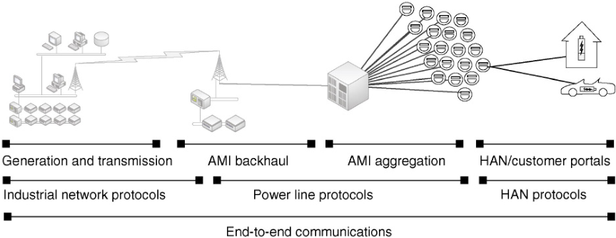

##### Security concerns:

* Smart meters are readily available and therefore require board- and chip-level security in addition to network security.
* Smart grid protocols vary widely in their inherent security and vulnerabilities
* Neighborhood, home, and business LANs can be used to ingress to the AMI

##### Security recommendations:

* Perform risk and threat analysis in the planning stages
* Same for end users (Power plants, factories, homes)
* Strong defense-in-depth and in perimeter will help mitigate the risk

### Industrial Protocol Simulators

##### Modbus:

* Modus Pal 
* Triangle Microworks Communication Protocol Test Harness
* Modsak

##### DNP3/IEC60870-5:

* The Axon Group
* Communication Test Harness, from Triangle Microworks

##### OPC:

* Matrikon
* Kepware

##### ICCP/IEC60870-6:

* Triangle Microworks IEC 6087-6 (TASE.2/ICCP) Test Tool

##### Physical Hardware:

* Not overly expensive, if you want to test, but can't reproduce a entire network, like with simulators
* Purchasing through eBay might help

# 7. Hacking Industrial Control Systems

## Motives and consequences

### Consequences of a successful cyber incident

* Delay, block or alter the intended process: Amount of energy produced
* Delay, block or alter information related to a process: Preventing efficient production metrics
* Unauthorized changes to instructions or alarm thresholds: Damage, disable plant
* Inaccurate information sent to operators: Disguise changes or cause the operator to initiate inappropriate actions

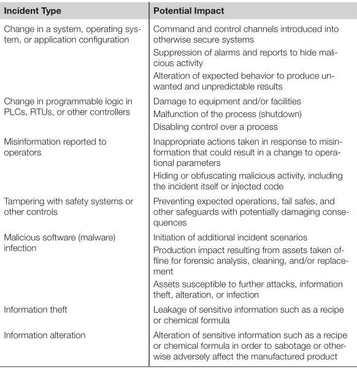

There are studies that show the successful hacking of a ICS

* *Sandia National Laboratories:* Showed that a simple man-in-the-middle attack can alter values, which can reduce expected output.
* *VIKING:* Investigate whether the manipulation of input data can alter the normal control loop functions, ultimately causing a disturbance.

## Common Industrial Targets

Despite being different, there are several systems that are prone to be targeted:

* *Network Services:* Active directory, Identity and Access management servers. Because they may be shared between business ans ICS networks.
* *Engineering workstations:* Used to exfiltrate or alter process logic.
* *Operator Consoles:* Used to trick human operators into performing unintended task
* *Industrial Applications:* SCADA servers, Historians, asset management
* *Protocols (Modbus, DNP3, EtherNet, etc.):* Used to alter, manipulate, blind or destroy almost any aspect of a ICS

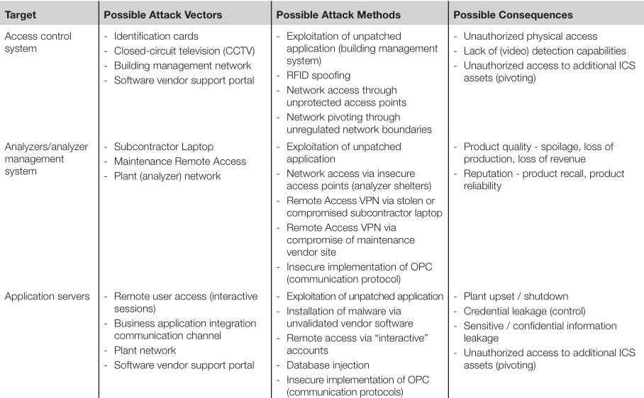

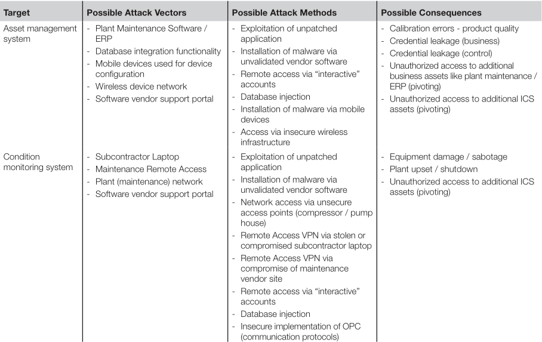

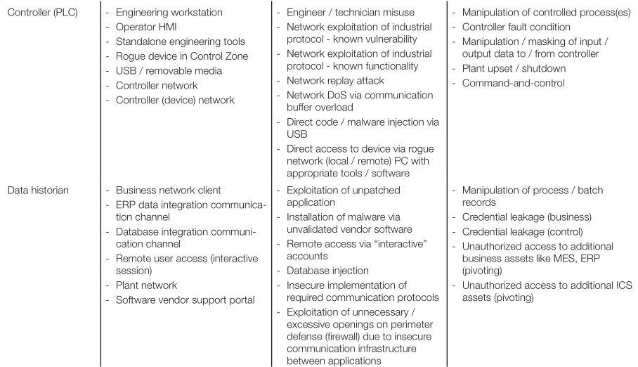

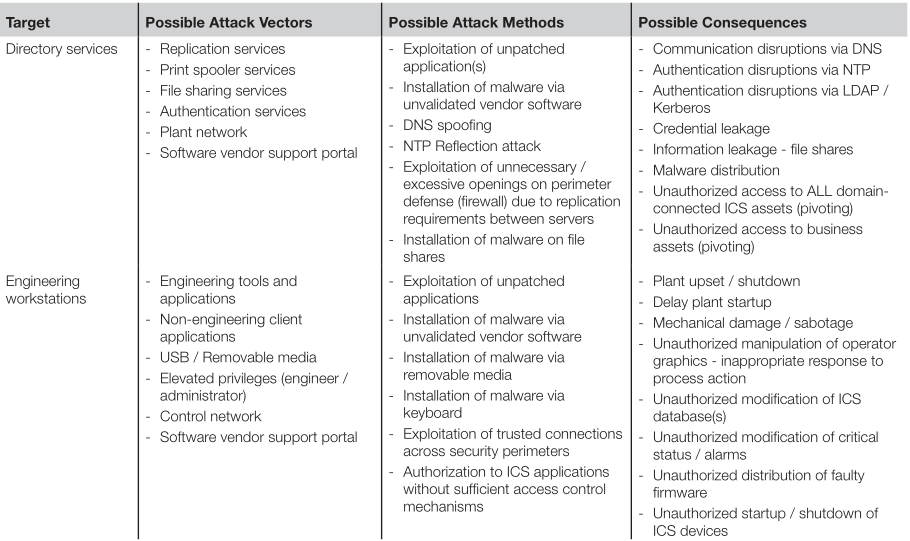

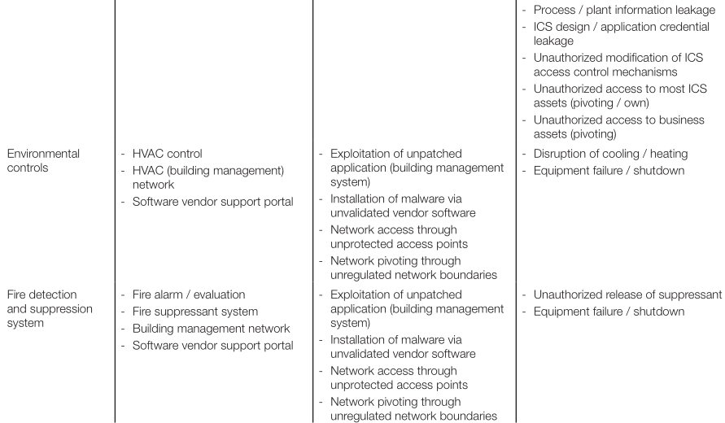

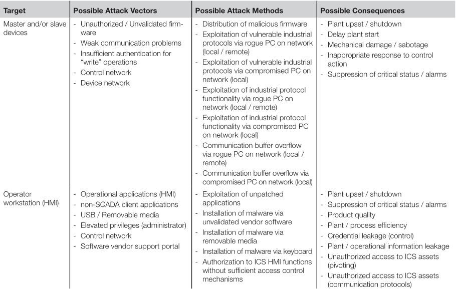

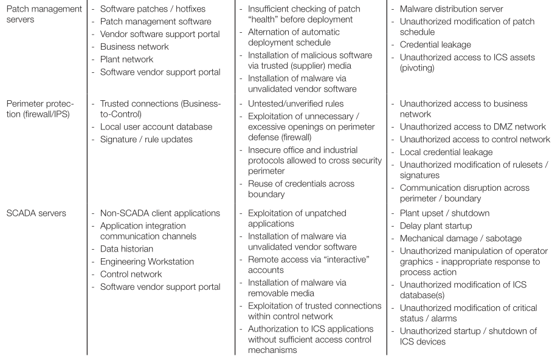

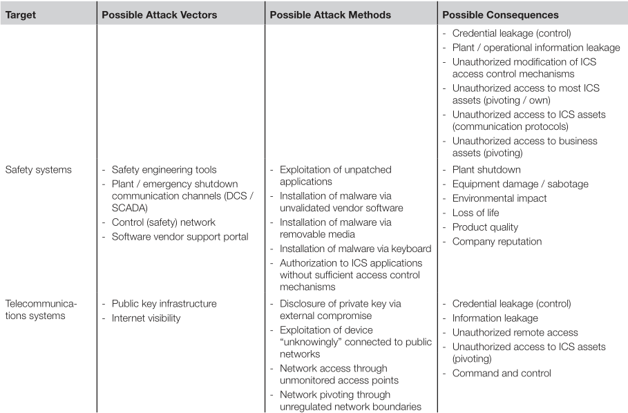

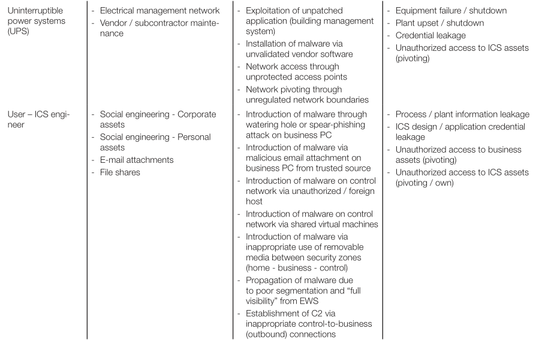

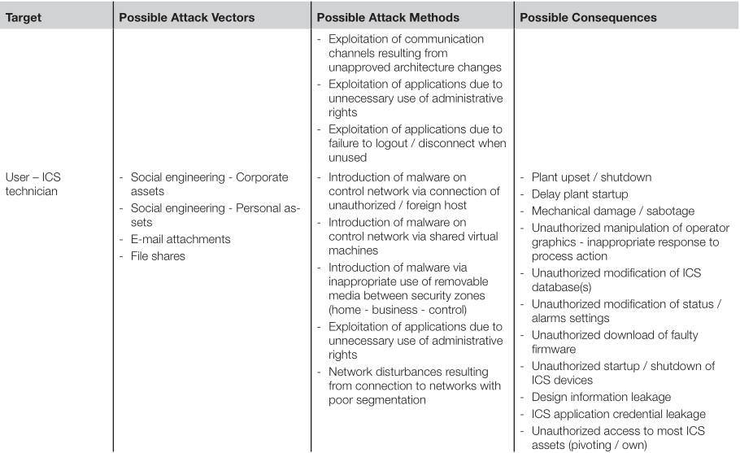

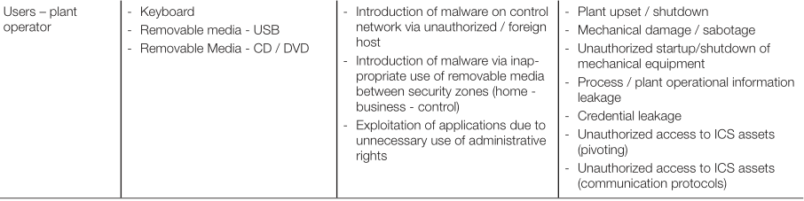

## Common Attack Methods

Important to know the Difference between compromising, and attacking a target.

* *Compromising:* Ability to exploit a target and perform an *unknown* action
* *Attacking:* Causing the target to perform a *undesirable* action

Many ICS devices can be attacked via the *exploitation of functionality* versus the *exploitation of vulnerabilities*. (Issuing a *Shutdown* command)

### Man-in-the-middle attacks

Very straightforward process if the communication between systems runs on unencrypted protocols.
The biggest challenge to a successful MitM attack is to successfully insert oneself into the message stream, which requires establishing trust.

### Denial-of-service attacks

When a malicious event attempts to make a resource unavailable.
A Well targeted DoS can trigger a shutdown given that the controller enters a state called LoC (Loss of Control) which in turn forces it to enter a safe state: Shutdown.
If the DoS is performed against a HMI, this is called LoV (Loss of View) and can also trigger a shutdown given the operators can not monitor what is happening.

### Replay attacks

It is possible to capture packets and then replay them to accomplish the same action.
If these packets are part of a authentication mechanism, they provide the hacker a authentication mechanism.
Now he can authenticate in the network and be regarded as a trusted peer
This is called: *Exploitation of functionality*

Replay attacks are useful given the command-and-control nature of the ICS.

For the subtle manipulation of industrial systems, knowledge of specific ICS operations is required, but to sabotage a system, almost anything can be used to disrupt operations.

### Compromising the HMI

One of the easiest ways to obtain unauthorised Command and Control of an ICS is to leverage the capabilities of human-machine interface (HMI) console.

A known device vulnerability is exploited to install remote access to the console leading to the host *compromise*. (Use MSf to exploit the target system and install a remote VNC server.

### Compromising the Engineering Workstation (EWS)

Similar to HMI
Important to realise the EWS has important confidential documentation (Design, configuration, plant operation) that make the target a much higher-valued asset than a HMI.

### Blended attacks

A *Blended threat* is an exploit that combines elements of multiple types of malware and usually employs multiple attack vectors to increase the severity of damage and the speed of contagion

Recently blended attacks have increased in complexity (Stuxnet).
They are capable to mutate and adapt to specific situations in a specific environment.

### Examples of weaponized industrial cyber threats

* *Stuxnet:* First, complicated, highly specific
* *Shamoon:* Destructive, wiped systems clean
* *Flame:* More complex derivative of Stuxnet, cyberespionage

#### Stuxnet

The book describes it's abilities and goals

##### Lessons learned

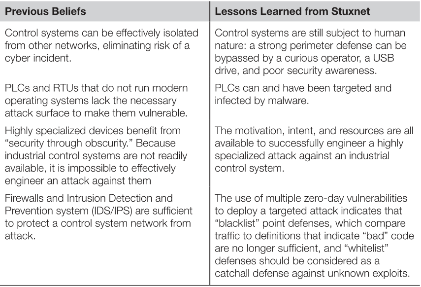

* To defend the ICS, we have to adopt a new "Need to know" mentality.
* If something is not explicitly defined, approved and allowed to execute and/or communicate, it is denied.
* Such high SW complexity and implementation requires above-average monitoring.
    * These measures include Layer 7 application session monitoring to discover zero-day threats and to detect covert communications over allowed "overt" channels.
    * More clearly defined security policies
    * Network whitelisting to control behaviour in and between zones.

#### SHAMOON/DistTrack

Information gatherer and destructive capabilities.
Constructed of 3 parts: Dropper, Wiper and Reporter.

#### Flame/Flamer/Skywiper

APT targeting middle-eastern countries.
Consists of modules:

* *Flame:* AutoRun infection routines
* *Gadget:* Update modules
* *Weasel:* Disk and file parsing
* *Telemetry:* handle C2 routines
* *Suicide:* self-termination
* *Frog:* steal passwords
* *Viper:* Capture screenshots
* *Munch:* capture network traffic

## Attack Trends

Shift from exploiting network layer and protocol layer vulnerabilities to application-specific exploits.
More recent: Shift from OS exploitation to the almost ubiquitously deployed client-side applications like web browsers, Adobe Acrobat Reader, etc.

Web based applications are also used heavily both for infection and for C2.
Employees in ICS use these services and they can't be monitored by the company, due to privacy.
Some companies even allow social media access through corporate firewalls.

### Evolving vulnerabilities: The Adobe exploits

Example of perspective shift, from low-level protocol to high level application.

The exploits use the ability within PDF's to execute code to perform malicious actions.

### Industrial application layer attacks

Adobe reader exploits are highly relevant because many computing products -Including ICS products- distribute manuals and other reference materials using PDF files and preinstall Adobe Reader.
This application remains unpatched, ergo possible vulnerability exploitation.

*Industrial Applications* are the applications and protocols that communicate to, from, and between supervisory, control, and process system components.

These applications are designed to control, either directly or indirectly, and therefore do not need to be infected with malware.
They can simply be used with malicious intent. (*Exploitation of functionality*)
They represent a problem that is not typically addressed through traditional IT security controls.

To mitigate this risk, it is going to be a lot easier and less costly to deploy appropriate security controls versus attempting to retrofit and/or replace the affected ICS equipment.

### Antisocial networks: A new playground for malware

People are subject to social engineering exploitation.
A attack targeting a specific ICS worker that, when opened, downloads and infects his computer is totally plausible.
Users at Pharmaceutical and Chemical sectors are highly probable of web-based malware encounters.
The best way to protect from these attacks is to block social media access within the network.

#### Cannibalistic mutant underground malware

Malware mutation is the ability of malware to auto-update itself. (Stuxnet and it's P2P network is a example of this)

## Dealing with an infection

Upon a infection do not immediately clean the system of infected malware.
There may be subsequent levels of infection that exist, yet dormant and may be activated as a result.

* The first step should be to logically isolate the infected machine from the network.
* Consider the safe and reliable operation of the manufacturing process as the primary objective.
* Always monitor everything
* Analyze available logs to help identify scope, infected hosts, propagation vectors and so on.
    * Retrieve legs from systems that have not been compromised, to perform comparative analysis.
* Sandbox and investigate infected systems.
* Be careful not to unnecessarily power-down infected hosts, as valuable data might be lost.
* Clone disk images for off-line analysis.
* Reverse-engineer detected malware
* Retain all info, for disclosure to authorities

If you have to reinstall OS, the initial copy should have been generated upon the system's arrival, and stored in a remote (off-site) secure location.

# 8. Risk and Vulnerability Assessment

Highlights of how to implement a risk and vulnerability assessment process specific for industrial systems.

## Cyber security and risk management

### Why risk management is the foundation of cyber security

*functional safety*: a cornerstone in the overall operation of the facility, as well as an important key performance indicator (KPI) used in evaluating a company.

Important to establish an acceptable level of risk tolerance.
It is possible to manage this unmitigated risk in four ways:

1. Mitigation (You manage)
    * Continuous process of identification, assessment and response
    * These risks cover a broad range of threats that include both internal and external sources
    * Majority of risks come from internal (Not maliciously, but carelessly)
1. Transferal (Others manage)
1. Avoidance (No one manages)
1. Acceptance (Stakeholders manage)

### What is risk?

* **Risk:** The potential that a given threat will exploit vulnerabilities of an asset ... And thereby cause harm to the organization

It is important to realize risk management does not end at updating and patching programs to remove identified security flaws.
It is also possible that one could reduce risk by "containing" an event and limiting the extent if resulting damage. (e.g. Network segmentation and creation of security zones and conduits following a initial breach)

The **Threat event** consists of components that all can significantly impact risk:

* Threat Source or Actor to carry out the event
    * Human aspect of the attack
    * Characteristics:
      * Capability to carry out the attack
      * Intent to cause harm
      * Opportunity to initiate the event
* Threat Vector to initiate the event
* Threat Target which the event attacks

It is very difficult for an organization to reduce risk focusing on outside sources because much of this is not in their direct control.

The *malicious* insider possesses ample intent to cause harm, but what intent does the "Unintentional" insider possess when performing an accidental action that causes harm to the ICS?
The Actual intent is very high (in-depth system knowledge, elevated access privileges, direct access to ICS assets, ...) 
The resulting net risk is very high.
This is why insiders are high targets, and can be victims of spear-phishing.

Operational security must manage both "virtual" and "physical" risks.
Consequences resulting from a cyber attack on a ICS are less likely to have a direct impact on the system itself, but rather cause the plant under control to operate improperly which may lead to shutting the plant down.

### Standards and best practices for risk management

Current standards and best practices pertaining to risk management frameworks and assessment techniques

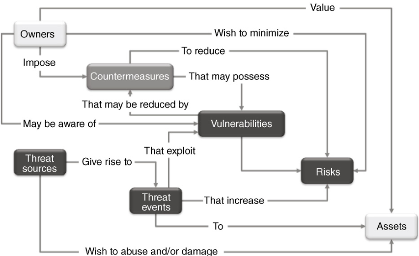

The basic guidance includes:

* Asset identification
* Threat identification
* Vulnerability identification
* Existing security controls identification
* Consequence identification
* Consequence analysis
* Risk ranking
* Security control recommendations

## Methodologies for assessing risk within industrial control systems

### Security tests

The objective is to establish a methodology that is based on criteria that help drive consistency from assessment to assessment, and that allows common vulnerabilities that may exist across multiple systems to be uncovered.

Any assessment, audit or test that is conducted therefore only represents a snapshot in time.
This is the motivation behind a "repetitive" process that is triggered by external events:

* Changes to the system (Component upgrade / system migration)
* Changes to the landscape (release of new exploit kit)
* Elapsed periods of time

It is important to look at not only the system-specific details (ICS vendor, network vendor, SW & HW revisions) but also site-specific factors (Geographical location, compliance with corporate polices, procedures, guidelines and standards)
This will then facilitate the identification of vulnerabilities within the system under consideration.

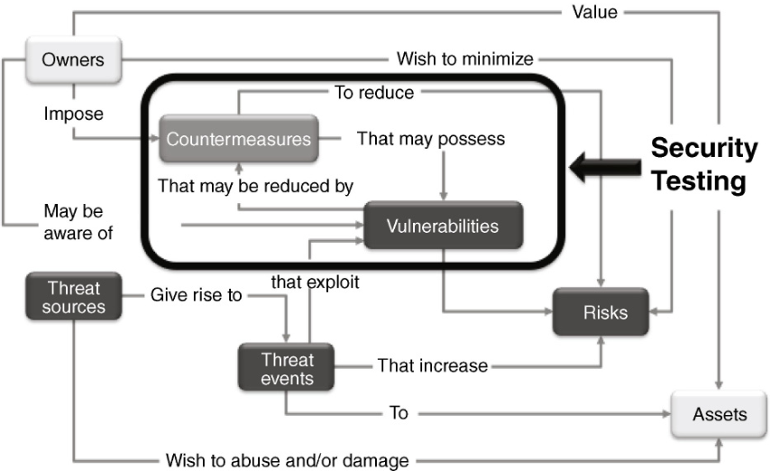

Once these vulnerabilities are identified, they will then be ranked in terms of severity and actions will be developed to remediate or mitigate these weaknesses.

The purpose of the security tests is not to exploit the system, but to determine the relative level of security a system possess and identify ways to improve the overall level of security that remains.

### Security audits

Performed to test a particular system against a specific set of polices, procedures, standards or regulations.
Audits do not typically uncover unexpected vulnerabilities.

### Security Vulnerability Assessments

Provide ICS users and businesses with a well-balanced cost versus value security evaluation mechanism.
The premise of this type of assessment is to look at the entire solution for the system under consideration. (For each ICS system and subsystem: servers, controllers, field instruments, PLC's, RTU's, ... Also considering User Identification, authentication, authorization)

It is not practical to perform a complete Vulnerability Assessment against 100% of the hosts within a ICS architecture, therefore they tend to focus on critical nodes.

### Establishing a testing and assessment methodology

#### Tailoring a Methodology for industrial networks

The overall focus of a security test targeting an Industrial Network shall evaluate all ICS perimeters.
The information obtained will be used to evaluate the overall network architecture. (How firewalls have been deployed on the conduits between various zones, communication channels (conduits) between ICS field networks, field controllers, and supervisory equipment)
It is important to include "social" aspects in the evaluation (How personnel manage the ICS to control the facility, ...)
The general rule is that pen tests should never be performed on an active, online ICS component, but rather limited to a off-line, la, or development system.

#### Theoretical vs Physical Tests

The risk to operational integrity is too great to allow even the slightest risk that the tests will impact manufacturing operations.
These situations require a "Theoretical" approach.

#### Online vs Off-line Physical Tests

* *Online:*
    * Represent a completely functional and operational ICS architecture that includes all the systems, networks, and data integration.
    * Contain volatile ICS components
    * Include third-party components
    * Could be used to test susceptibility of network vulnerabilities to attack
    * Can test less critical third-party components for vulnerabilities
* *Off-line:*
    * Reflect a small subset of the overall architecture, and can omit key components that are a valuable piece of assessment.
    * Can be performed when Online tests can't, due to criticality
    * Can include vitalization technologies
    * Best at testing ICS components and their vulnerabilities
    * Can be used to test the ability to exploit vulnerabilities

The primary goal of a ICS security test should be to secure the system as best as possible, rather than only securing those vulnerabilities that may be visible to a potential attacker.

The preferred practice of security assessment is to use the white-box approach.

## System Characterization

Once the premise of the security test that will be conducted has been defined as "physical" and "online", the first activity performed is to characterize or identify all physical and logical assets that comprise the system under evaluation.

System characterization and asset identification is best performed using a zone concept.
Once this trusted boundary is established, it is important to delineate all of the external entry points that require penetration of the perimeter.

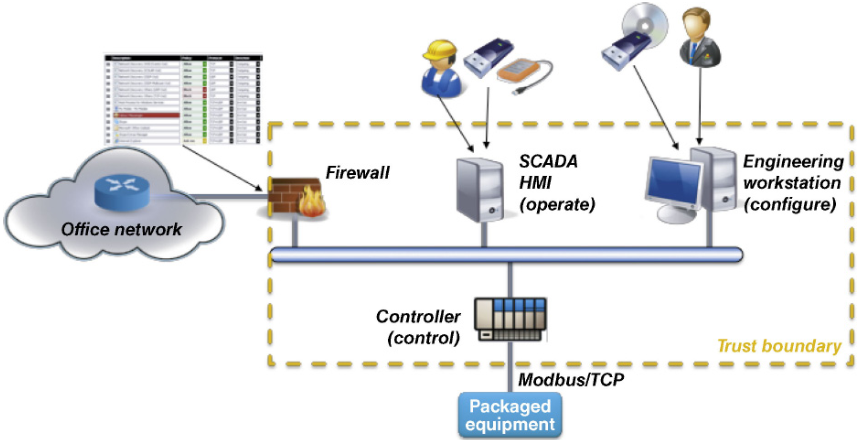

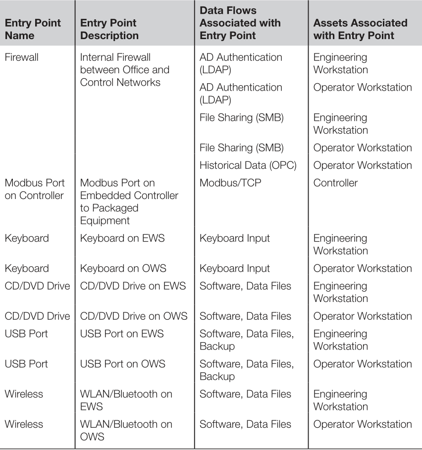

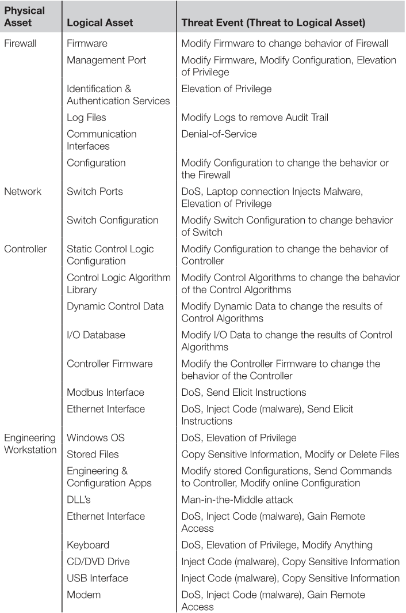

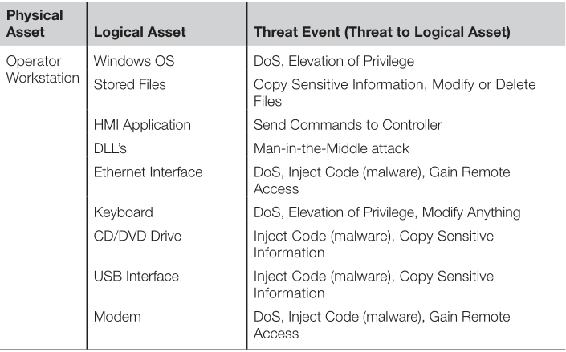

### Data collection

Documentation is validated and the system assets are characterized or identified via a variety of data collection methods.

There are scanners that can assist in identifying devices, but they can alter the network and cause catastrophic effects on some ICS components. (Use active scanners only off-line) 

### Scanning Industrial Networks

#### Device Scanners

* *nmap:*
    * One of the most popular device scanners
    * Capabilities: Host discovery, host service detection, OS detection, evasion and spoofing capabilities, and capability to execute custom scripts.
* *ping:*
    * Uses ICMP (Internet Control Message Protocol) but now unreliable because many hosts block requests.
* *arping / arp-scan:*
    * Identify hosts within a network, even across security perimeters protected by firewalls
* *netstat:*
    * Ability to display a number of host-based network features (active, listening network connections, application and associated service/port mapping and routing tables)
    * Friendly and passive tool

#### Vulnerability Scanners

Examples: OpenVAS, Nessus, Guard, Nexpose, Core Impact, SAINT scanner)
Compare target with known vulnerability databases.

#### Traffic Scanners

Collect network packets and provide them for subsequent analysis that may include host identification, data flows, and firewall rule set creation.

* *Wireshark:*
    * analysis of network traffic in the form of pcap files.
    * Uses protocol dissectors so that protocols used in the various Operating System Interconnection (OSI) layers can be dissected and presented before passing them to the next layer. (GUI visualization)
    * Has the ability to Dissect a wide range of Industrial Protocols

#### Live Host Identification

##### Quiet / Friendly scanning techniques

* `arping -i eth0 -c 1 192.168.1.1` (Send a single ARP request to one target via a specific network interface)
* `sudo arp-scan -I enp0s20u2u1 -v -l` (Network-wide scan with interface (-I) and verbose)
* `tcpdump –n –i eth0 –w out.pcap dst 192.168.1.1 or src 192.168.1.1` (Initiate a packet capture that does not resolve address to hostname (-n) using a specific network interface)

##### Potentially noisy / dangerous Scanning Techniques

* `nmap -sn 192.168.0.1/24` (Perform a ping sweep on a single subnet)
* `hping3 -S -p 502 192.168.0.1` (Sends a single packet that only contains the TCP header flag SYN set (-S) to a single target (192.168.1.1) using the port for Modbus/TCP (-p 502)

##### Port Mirroring and Span Ports

Most networks today are built using switches that provide a single collision domain  between the host and the switch that it is connected. The switch is then responsible for maintaining a local hardware address (MAC) table and forwarding traffic as needed to the access ports that contain the desired MAC destination address.
This means that the only types of traffic that can be monitored from a computer’s network interface is the traffic specifically destined for the computer and local network broadcast and multicast traffic.

**Always remember than any tool used in an online ICS environment should be thoroughly tested for 
potential impact prior to use in a production environment. The procedures for any online test should 
also include an action plan that should address the steps to be taken in the event of an unexpected 
consequence occurring during the test.**

##### Command Line Tools

Tools installed on most system in ICS.
Some don't inject traffic into the network.

* `ipconfig` Windows command-line tool that displays current network configuration values, but can also be used to refresh DHCP and DNS settings.
* `netstat` determine what applications are running on a computer and how they map to ports ans service names. (Use `tasklist` to transform service PID to process name)
* `wmic` set of system management features

##### Hardware and Software inventory

The development of these inventories may be one of the most valuable deliverables from a physical security test.
The steps are as follows:

1. `arp-scan` to identify all network-connected hosts. Must be run on all layer 3 broadcast domain or subnet. (Passive mode: Wireshark tcpdump)
1. Confirm identified hosts are authorized for Industrial Network and update system architecture drawing
1. Collect host platform information for each network-connected device
    * Include base HW, OS information, network configuration details, BIOS revision, firmware details)
    * Can be obtained with `systeminfo` command
1. Collect application information for each network-connected device
    * Include application vendor, name, revision, installed patches
    * `wmic` command with the `product get` option
1. Consolidate information into spreadsheet or portable database

##### Data flow analysis

Sometimes asset owners or ICS vendors don't completely understand underlying communications between hosts that comprise the ICS. 
It is very important, as the ICS transitions from previous flat architecture, to that of segmented into various security zones, that communication channels that exist between security are well documented.

Steps required to create a data flow diagram:

1. Collect a snapshot of the network traffic for the system operating under normal conditions
    * `tcpdump`
    * If multiple dump files are required, merge them with `mergecap`
1. Open Wireshark and use the feature *Statistics* using *conversations*. The output reflects host-to-host sessions that where active during the network capture
    * The TCP tab shows the TCP ports used during the session
    * The UDP tab shows the UDP ports used during the session

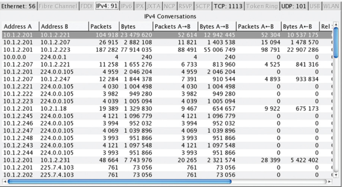

## Threat Identification

Most difficult phase of the process.
It is commonly omitted.
It can be very difficult to describe all aspects of the unmitigated risk that is present for a particular industrial environment.
Physical and logical assets must now be mapped to specific threats that can later be assessed as to weather appropriate controls are in place to secure theses assets from the identified threats.

Threat mapping can be performed in:

* organization by physical asset
* threat source (outsider, insider)
* intent (intentional, unintentional)

### Threat actors/sources

Most important to realise that internal unintentional mistakes can occur, and are more probable than external intentional threat.
This is the reason why objective risk process is necessary.

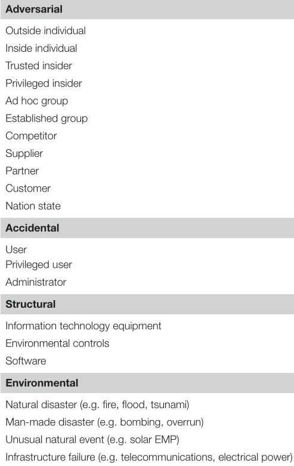

Begin the threat identification activities by focusing on 4 different threat sources:

* Intentional Outsider (malicious)
* Unintentional Outsider (accidental)
* Intentional Insider (malicious)
* Unintentional Insider (accidental)

### Threat vectors

Identifies the method by which the threat source will impact the target. 
This directly corresponds to the Entry Points in the context of the methodology established in this section.

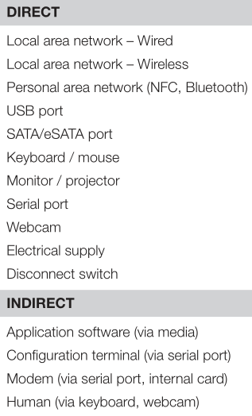

### Threat Events

Represents the details of the attack that would be carried out by a particular Threat Source
When the source is an adversarial one, the Threat Event is typically described in terms of the tactics, techniques, and procedures (TTP) used in the attack.

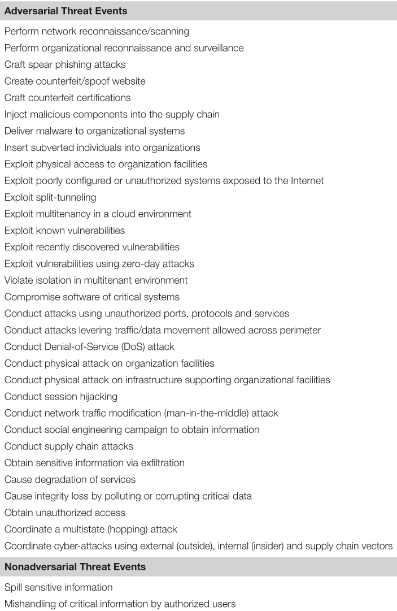

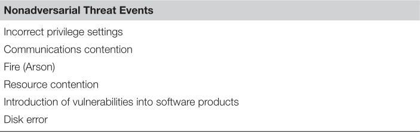

### Identification of threats during security assessments

When a threat is discovered during the Security Assessment, add it to a spreadsheet for tracking and measuring risk.

Threats could reveal any of the following:

* Infected media discovered from anti-virus logs
* Infected desktop or laptop workstations discovered from Windows Event logs
* Corrupted static data discovered from local disk evaluation
* Data copied to untrusted location discovered from network resource usage
* Accounts not deactivated discovered from local/domain account review
* Stolen credentials discovered when used to access unauthorized hosts
* Overload communications network discovered when reviewing network statistics

## Vulnerability Identification

This activity will combine automated tools, such as vulnerability scanning applications, with manual analysis of data collected throughout the exercise.
Vulnerabilities may exist in the form of miss configured settings, improper authentication, not only software bugs.
The idea behind such a thorough process is to attempt to review and discover many of the more common ICS vulnerabilities 

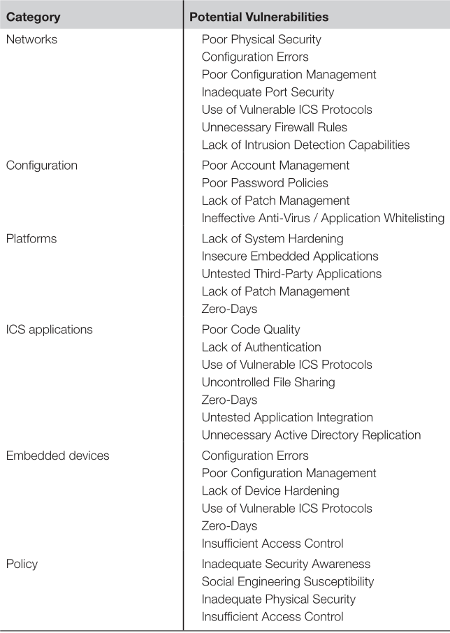

### Vulnerability Scanning

Process of methodically reviewing the configuration of a set of hosts by attempting to discover previously identified vulnerabilities that may be present.

Example manual vulnerability scanning:

1. The `wmic` command is used with the product get option to list all of the installed applications running on a Windows 2003 Server host.
2. The SCADA application software is shown as “IGSS32 9.0” with the vendor name “7-Technologies” and a version of 9.0.0.0.
3. Using OSVDB, “igss” is entered in the Quick Search field and several results are returned. Selecting the most recent item, a link is provided to an advisory published by ICS-CERT that confirms that the installed version of software has a published vulnerability.
4. The advisory contains information on how to download and install a software patch from the software provided.

If automating the process, you must be able to assess the application that is going to be installed in the system (Check for virus, bugs)

Important to perform automated white-box scans, which are easier on the network and provide a perspective hackers wont be able to access (White-box vulnerability scan)
Normally the Vulnerabilities found during a White-box scan far exceed the vulnerabilities found during a black-box scan

### Configuration auditing

The absence of software vulnerabilities does not mean that the software has actually been installed, configured, and even hardened in a manner that helps to reduce the possibility of a breach.

* *Compliance auditing*
    * compares the current configuration of a host against a set of acceptable settings.
    * Some companies that provide configuration benchmarks include: NIST, Center for Internet Security, NSA, Tenable Network Security.
    * The Nessus vulnerability scanner provides the ability to import predesigned or customized files that can be applied against target systems.

###  Vulnerability prioritization

Not all vulnerabilities that are discovered during a security test are necessarily exploitable.
What proves more effective is an objective method of rating the severity of vulnerabilities as they are discovered within a particular architecture.
A vulnerability that exists in a Internet-facing corporate web server does not represent the same amount of risk as the vulnerability existing on a web server on a protected security zone that is nester deep within the organization.

#### Common vulnerability scoring system

Free, open, globally accepted industry standard that is used for determining the severity of system vulnerabilities.
Each vulnerability is provided with one to 3 different metrics that produce a score on the scale 0 - 10 that reflect the severity of the vulnerability applied in different situations.
Each score consists of a "vector" that represents the value used for each component in calculating the total number.

## Risk Classification and ranking

Provides a means of evaluating the threats and vulnerabilities identified so far, and creating an objective method to compare these against one another.

### Consequences and impact

The last piece of information needed is a determination of the consequences or impact to operations that would occur should the cyber event occur.
Some examples of the consequences that could occur should any ICS component fail to perform the intended function.

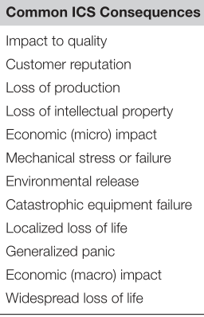

### How to estimate consequences and likelihood

The DREAD model provides an indirect means of calculating consequences and likelihood by looking at these factors in a different way.

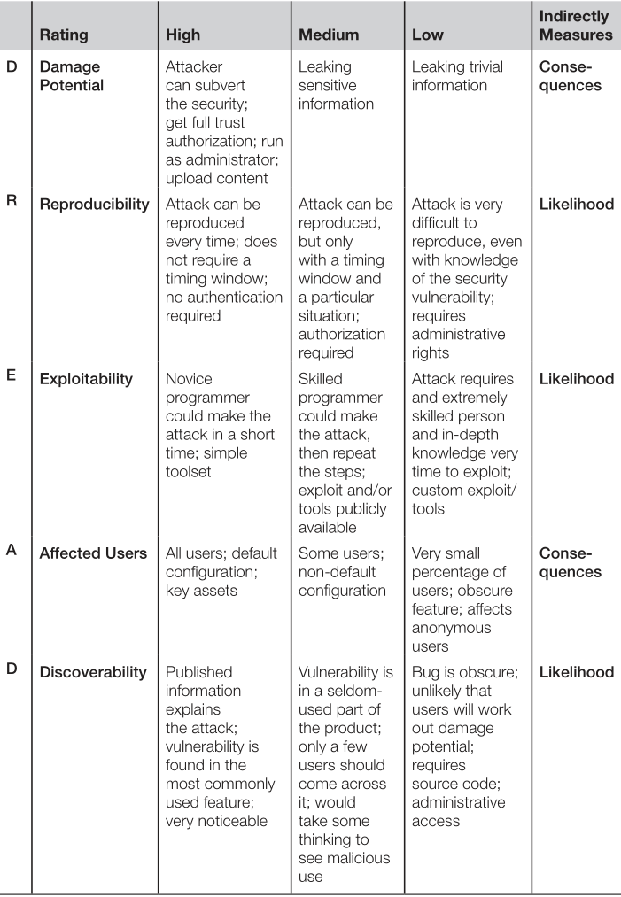

Pairing this model with The Six Sigma Quality Function Deployment (QFD) transforms the qualitative parameters (High, Medium, Low) into quantitative values that can be analyzed statistically.

### Risk Ranking

The application of QFD to the DREAD model will allow the data to be consolidated and used alongside the asset, threat, and vulnerability data.

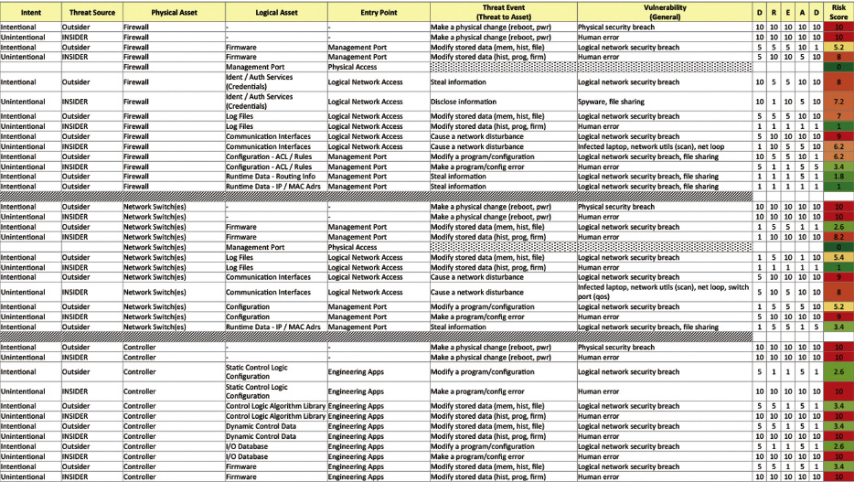

In the previous image, 10 = high, 5 = medium and 1 = low.

## Risk Reduction and Mitigation

The process has yielded a prioritized list of items in terms of net “unmitigated” risk to the ICS and the plant under its control. 
Some risks may have been mitigated to an acceptable level following the security and vulnerability assessment. 
The final activity for those remaining risk items is to apply a range of cyber security controls or countermeasures to the assets within the ICS in order to reduce or mitigate these risks.

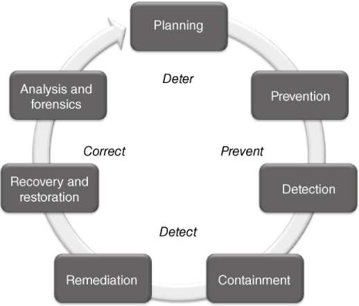

Security should be considered as a long-term “strategic” investment rather than a short-term or one-time “tactical” expense.
The operational security used to protect these same facilities is treated in a similar manner and should receive continuous attention (and budget) like other operational expenses (maintenance, improvements, training, etc.).

# 9. Establishing Zones and Conduits

By isolating assets into groups, and controlling all communications flow within and between groups, the attack surface of any given group is greatly minimized.

Security zones can be defined from either a "physical" or "logical" perspective.

* *Physical*: Defined based on the grouping of assets based on their physical location.
* *Logical*: Assets are grouped based on a particular functionality or characteristic.

Security Conduits are actually a special type of zone that groups “communications” into a logical arrangement of information flows within and between various zones
Conduits can also be arranged according to physical (network cabling) and/or logical (communication channels) constraints.
When properly implemented, zones and conduits limit digital communications in such a way that each zone will be inherently more secure.
By it's nature, supports other well known security protocols such as the Principle of least privilege and the Principle of least route (Network node is only given the necessary connectivity to perform its function).

As zones and conduits become more granular, there will be a corresponding improvement in security (Figure 9.1). It is therefore important to carefully identify zones in the early stages of the cyber security lifecycle.

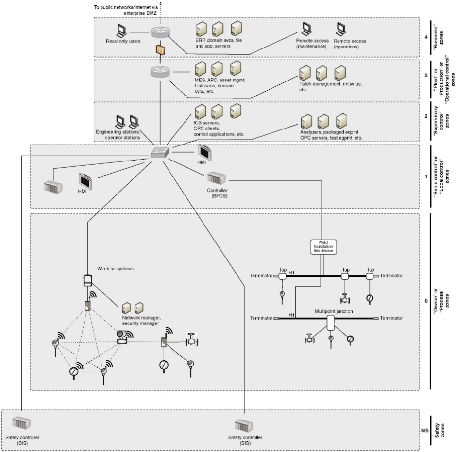

Once defined, zones and conduits will help to pinpoint areas where network and host security and access controls may be required.
This is because, by limiting communications to defined conduits, each conduit represents a potential network attack vector.
If implemented poorly, zones and conduits will result in a well-organized architecture; if implemented properly, they will result in a highly secure architecture.

Network security controls (Firewalls, IDS, IPS, ACLs) will be highly effective when implemented against a highly effective when implemented against a well-organised architecture with clear policies that are defined around zones and conduits.
Consider a grouping of assets that cannot be protected individually with anti-malware defenses like anti-virus and application whitelisting.
These assets can be logically grouped into a zone, and the anti-malware defenses are implemented on the conduit(s) into this zone.
This is one effective way asset owners are able to continue operation of legacy and even unsupported systems (e.g. Windows XP) through the creation of zones of related assets, and then applying strong security controls on the conduits entering these zones.

## Security Zones and Conduits Explained

A good analogy to security zones is to consider how many industrial facilities maintain separation of basic control and safety-related assets.
This separation occurs, not just because of existing laws and regulations, but because of the underlying layers of protection that each of these systems provides, and how the relative protection of each system is unique.  

Assets at a particular site are grouped based on their relative security requirements or “security level.”
These zones are then created as either “external” ones, or when multiple layers of protection are required, they can be “nested” inside one another.
This allows security controls to be deployed to zones (and the assets they contain) based on the unique security requirements of each.

## Identifying and Classifying Security Zones and Conduits

One of the greatest challenges in establishing proper security zones and conduits is the creation of a set of base requirements or “goals” that are used to determine if a particular asset should be placed in a given zone.

## Recommended Security Zone Separation

When defining highly granular zones, it should be assumed that there will be an overlap that prevents adequate zone and conduit enforcement (A zone created by physical control subsystems is likely to overlap with zones defined logically by specific protocols)

When assessing the network and identifying potential zones, include all assets (physical devices), systems (logical devices like software and applications), users, protocols, and other items.
Attempt to separate two items, such as a protocol from an asset.
If the two can be separated without impacting either item’s primary function, they belong to two functional groups, and are therefore excellent candidates for their own zones.
(For example, if some SCADA systems use the DNP3 protocol, create a list of all devices currently communicating over DNP3.
Assess each to see if DNP3 is necessary to its function or not (it may support multiple protocols, and may be actively using a different protocol to perform its functions).
If not, remove it from the functional group, and if possible disable the unused protocol on the SCADA server as well.
The result will be a list of all assets legitimately using that protocol.

Similarly, consider which assets are connected to each other on the network, both physically and logically.
Each represents a functional group based on network connectivity and data flow.
Again, assess each item in question individually, and if it does not need to belong, remove it from the group.
A functional group can be based on almost anything. (Safety, Basic Process Control, Supervisory Controls, Peer-to-Peer Control Processes, Control Data Storage, Trading Communications, Remote Access, ability to patch, redundancy, malware protection, and authentication capability)

### Network Connectivity

Networks should be considered both physically (what devices are connected to other devices via network cables or wireless connections) and logically (what devices share the same Routable network space, subnet or access control list).

* Physical networks, are easy to determine using a network map.
* Logical network boundaries are defined by the use of devices operating on OSI Layer 3 (Routers, advanced switches, firewalls) to separate a physical network into multiple address spaces.
These devices provide a logical demarcation between each network.
This forces all communications from one logical network to another to go through the Layer 3 device, where ACLs, rule sets, and other protective measures can be implemented.

### Control Loops

A control group consists on the devices responsible for a particular automated process.
In most cases, a control group will consists on a sensor, a controller, and an actuator.

Building a functional group based on a control loop is a very precise example.

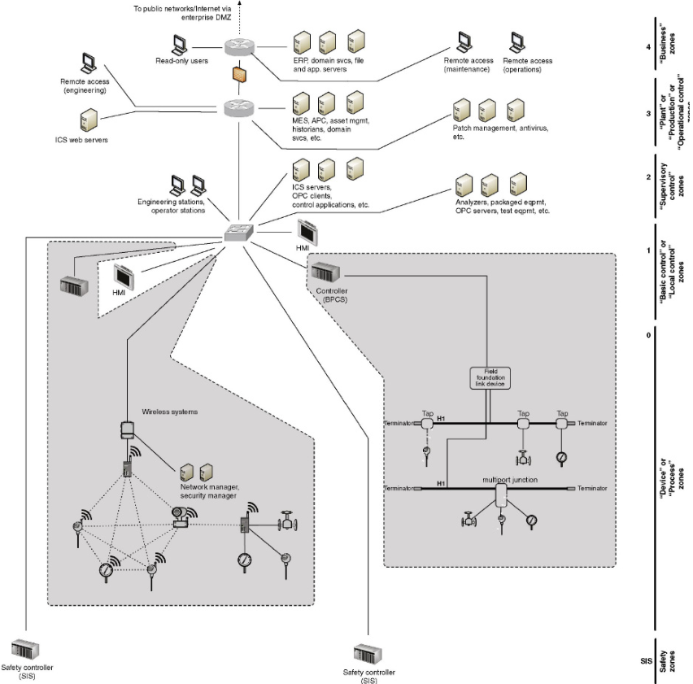

### Supervisory Controls

Each control loop is also connected to some sort of supervisory control —typically a communications server and one or more workstations— that are responsible for the configuration (engineering workstation EWS), and monitoring and management (operator workstation HMI) of the automated process.
Because the HMI is responsible for the PLC, these two devices belong to a common functional group.
However, because the HMI is not directly responsible for those IEDs connected to the PLC, the IEDs and PLC are not necessarily in a common functional group as the HMI (they belong to a common functional group based on some other common criteria, such as protocol use).
 All PLCs controlled by the HMI are included, as are any “master” HMI, communication servers, or control management systems that might have responsibility or control over the initial HMI

 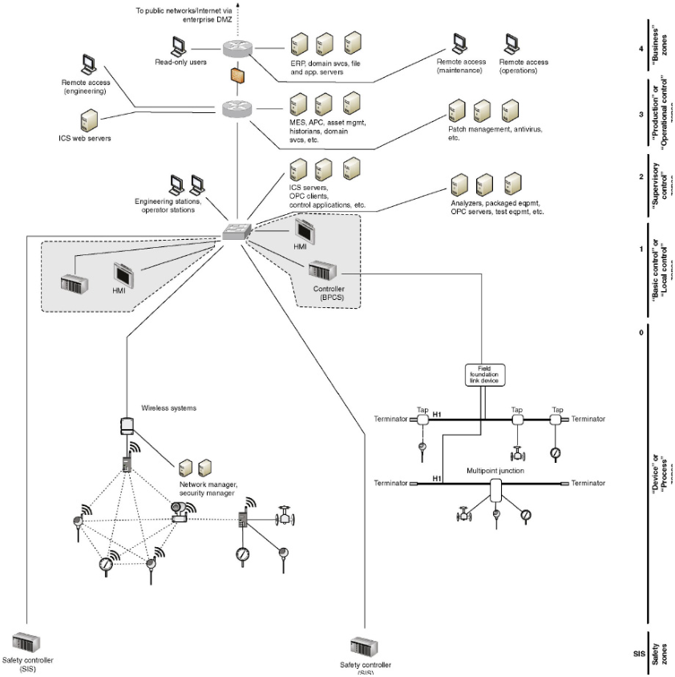

### Plant level control process
A Master Controller, Master Terminal Unit (MTU), or SCADA Server may be used to manage multiple HMIs, each responsible for a specific part of a larger control process.
This same master device now represents the root of yet another functional group—this time containing all relevant HMIs.

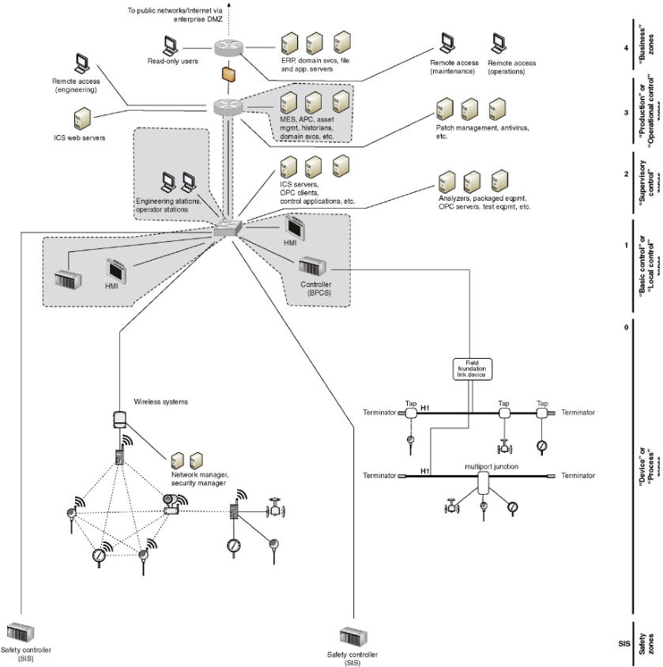

#### Control Data Storage

Many industrial automation and control system devices generate data, reflecting current operational modes, status of the process, alarms, and other vital manufacturing information.
The data historian system may collect data from throughout the control system network, supervisory network, and in some cases, the business network.

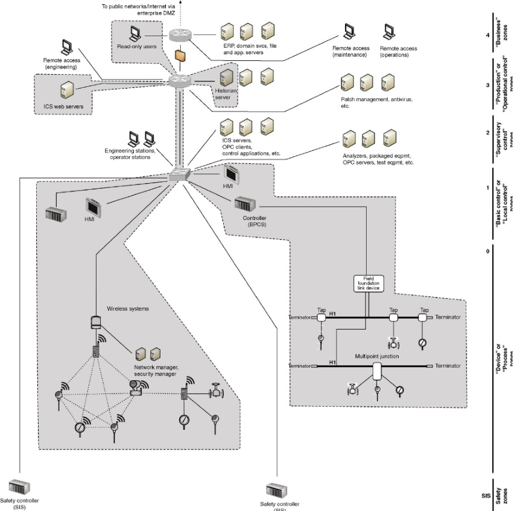

#### Trading communications

The need to communicate between control centers (e.g. electric transmission and pipeline sectors) is sufficient to justify a protocol such as the ICCP (Inter-Control Center Communication Protocol)
In this functional group, the remote client devices are all explicitly defined.
These remote clients should be included within the functional group, as they have a direct relationship to any local ICCP servers that may be in use.
Because ICCP connections are typically used for trading, access to operational information is necessary.
This could be a manual or automated informative process, which most likely involves the historized data stores of the Data Historian.
Making the Data Historian part of the "Trading Communications" zone.

#### Remote Access

In the context of security zones and conduits, it is important to understand that “remote access” refers to any communication through conduits to “external” zones.

When looking at the problem from a zone-and-conduit perspective, they are similar in terms of two “trusted” zones connected via what may be a “trusted” or “untrusted” conduit.

Remote access to control system devices should be controlled via specialized VPN's or Remote Access Servers (RAS) and should only allow explicitly-defined, point-to-point connections from known entities, over secure and encrypted channels.

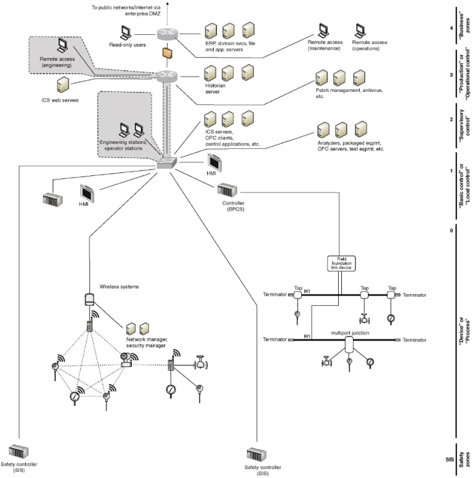

#### Users and Roles

It is important to limit users, their devices and their roles.
This is accomplished with a IAM.
The most well-known example of an IAM is Microsoft's Active Directory. 
Below is a functional group containing a user and those services that the user is allowed to interface.

The result of mapping roles and responsibilities to a user is the monitoring of that user's access and determining when this is unauthorised.
Role-Based Access Control (RBAC) provides a mechanism to configure specific access privileges to specific roles, and then assign individual users to these roles.
Typically the responsibilities associated with a given role do not change over time; however, the roles assigned to a particular user can change.
By placing a user in a functional group with only those devices he or she should be using, unauthorised activity could be prevented.
Although zones are defined, they still need to be properly implemented and secured.

#### Protocols

The protocols that a device uses in industrial networks can be explicitly defined in order to create functional groups based on protocols.
Only devices that are known to use DNP3, for example, should ever use DNP3, and if any other device uses DNP3, it is a notable exception that should be detected quickly and prevented outright if possible.

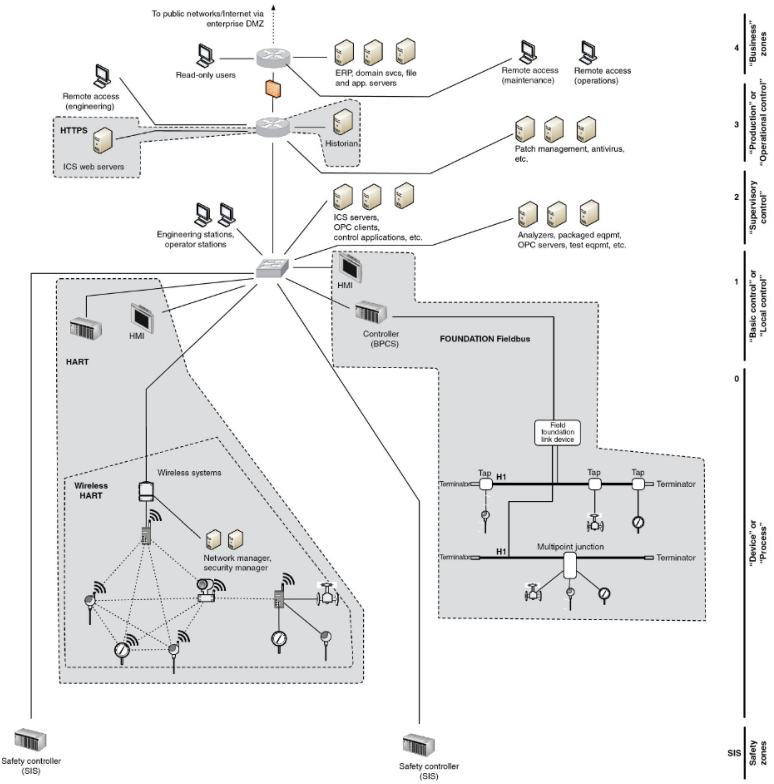

#### Criticality

Zone-based security is about isolating common influencing factors into functional groups so that they can be kept separate and secure from other non-influencing factors
Critical assets are extrapolated to the critical function group(s) to which they belong, which may or may not contain other critical and/or noncritical assets.
A good rule of thumb is that any zone that contains a critical asset is a critical zone.
If non-critical assets are also present in the zone, they must either rise to meet the minimum security requirements of the critical zone, or be moved into a separate zone.

Functionally defined zones should be assessed within the context of their criticality, and vice-versa.
A good way to proceed would be to assert the protection between critical and noncritical zones, and then additional protection between systems within each zone.

Granular zoning provides the following benefits:

* It will help to minimize the scope of an incident, should one occur, by further separating systems according to the Principle of Least Route. If an asset is compromised, it will only be able to impact a limited number of systems as the ability to communicate to other zones via defined conduits is restricted.
* It will help to secure critical devices from the insider threat, such as a disgruntled employee who already has legitimate physical and logical access to the parent zone since only limited communication channels are permitted between zones.
* It will help to prevent lateral attacks from one critical system to the next—if all critical systems are grouped together solely because they are all “critical,” a successful breach of one critical system puts the entire critical infrastructure at risk.

## Establishing Security Zones and Conduits

Conduits are essentially a type of zone that only contains communication mechanisms as its assets

In terms of conduits, these assets are communication assets, such as active and pas- sive network infrastructure (cables, switches, routers, firewalls, etc.) as well as the communication channels that are transmitted over these cables (industrial protocols, remote procedure calls, file sharing, etc.).

Zones are assigned a relative security level that is used to create the foundation for the security requirements and associated characteristics that will be applied to all assets contained within the zone.
These characteristics include:

* Security policies
* Asset inventory
* Access requirements and controls
* Threats and vulnerabilities
* Consequences in the event of a breach or failure
* Technologies authorized and not authorized
* Change management process
* Connected zones (conduits only).

As each of the characteristics of a zone are defined, the allocation of assets within the zone become obvious, including the possible creation of nested subzones for particular assets that may be align with other assets within the particular zone.
The assets now contained within a zone are then evaluated for threats and vulnerabilities in order to determine the resulting risk to the zone should these assets cease to perform their intended function.

In most industrial architectures, the physical network is the conduit.
It is also important to evaluate the vulnerabilities that may exist within the active network infrastructure, including switches, routers, and firewalls since the loss of any of these components can introduce significant risk to not only the network (conduit), but all zones connected via this conduit.
One of the leading root causes of compromises to secure industrial networks is from misconfiguration of appliances placed on conduits that connect less-trusted “external” zones to more-trusted “internal” zones.
These configuration errors commonly result from attempting to configure the communication access control without sufficient documentation of the content of each of the desired communication channels crossing the conduit.

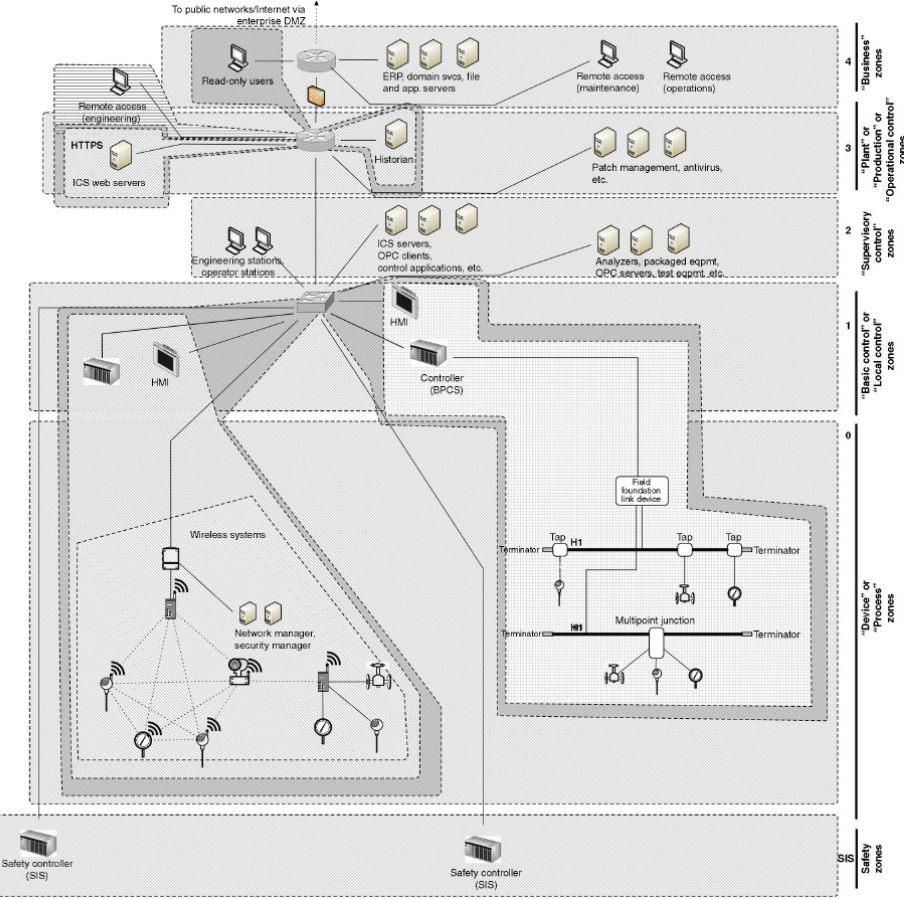

# 10. Implementing Security and Access Controls

The process of securing zones can be summarized as follows:

1. Map the logical container of the zone against the network architecture, so there are minimal network paths of communication channels onto and out of each zone. (Creating a zone perimeter and from this entry/exit points are identified.
1. Make necessary changes to the network so the network architecture aligns with the defined zones. (If two zones coexist within a flat network, segment the network in order to separate the zones)
1. Document zone for purposes of policy development and enforcement.
1. Document the zone for purposes of security device configuration and monitoring.
1. Document the zone for the purposes of changed management.

Each zone has to be as isolated as possible.
Communication can be secured using a perimeter security device, such as a next-generation firewall.
If intra-zone communication is necessary, the use of VPN or other encrypted network access control to enforce a point-to-point route between one split zone is allowed.

## Network Segmentation

In accordance with the principle of least route: a device that does not physically belong to a zone should not be allowed to directly connect to that zone or to any device within that zone.

Effective method for zone separation:
* Identify and document all networks into and out of each zone
* For each conduit:
    * Start at layer 1 and work up to layer 7.
    * For each layer, assess if network segmentation at that layer is feasible for that conduit.
    * For more critical conduits, aim for greater segmentation
    * For each desired layer of segmentation, implement appropriate network security and access controls to enforce that segmentation.
    * Provide sufficient reporting capabilities, in case of a breach.

### Zone and security policy development

With defined zones and conduits, the organization is armed with the information to satisfy several compliance requirements.
Documenting all zones within a context of the organization's security policy provides many benefits, by clearly identifying what systems may be accessed by other systems and how.

### Using zones within security device configurations

For each zone, the following list should be maintained at a minimum:

* Devices belonging to the zone, by IP address and preferably by MAC address as well.
* Software inventory for devices contained within the zone
* Users with authority over the zone, by user name or other identifier, such as Active Directory Organization Unit or Group.
* Protocols, Ports, and Services in use within the zone.
* Specifically forbidden technologies

If additional metrics are identifiable, additional lists should be created. 
Depending on the number of zones that have been defined, this may require several lists.
Five (device, users, applications, ports/services, technologies) for every established zone.

## Implementing network security controls

To effectively secure inbound and outbound traffic, two things must occur:

1. All inbound and outbound traffic must be forced through one or more known network connections that are monitored and controlled.
1. One or more security devices must be placed in-line at each of these connections (this could be a security capability built into network communication switches and routers).

For each zone, appropriate security devices should be selected and implemented using the recommendations below:

### Selecting network security devices

At a minimum, use a firewall.
Additional security can be used depending on need (IDS, IPS, Unified Threat Management (UTM) devices, Network Whitelisting Devices, Application monitors, and Industrial Protocol Filters.

It is recommended to use both Firewalls (Shallow Packet Inspection) and IDS (Deep Packet Inspection).

IDS is preferred over IPS in ISA model levels 1-3 because it can generate false positives, which might be blocked and cause the network to malfunction.
In ISA levels 3-4 IPS (Communications between industrial and business zones) can be used.

The data diode is a way of enabling hardware-level one-way communication. 
Making it impossible to transmit data from the opposite direction.

### Implementing network security devices

Greatly simplified process if previous analysis tasks have been completed.

#### Firewall configuration guidelines

#### Intrusion Detection ans Prevention configuration guidelines

The main difference between IDS and IPS are the extent of the rules to enforce once a packet has been identified.
IDS can alert, whereas IPS can kill the communication or enforce certain rules

#### Recommended IDS/IPS rules

1. Prevent and undefined traffic from crossing zone boundaries
1. Prevent and defined traffic containing malware or exploitation code from crossing zone boundaries
1. Detect and log a suspicious and abnormal activity within a zone
1. Log normal activity within a zone
1. Log all traffic originating from the remote access clients.

#### Anomaly-Based Intrusion Detection

Uses statistical models to detect anomalies.
It does not require any specifically defined signature to detect a threat.
This allows them to detect 0-day attacks.

#### Protocol anomaly detection

Only verifies protocol-level anomalies.
Malformed messages, sequencing errors and others.
Very powerful against 0-day exploits.

#### Application and Protocol Monitoring in Industrial Networks

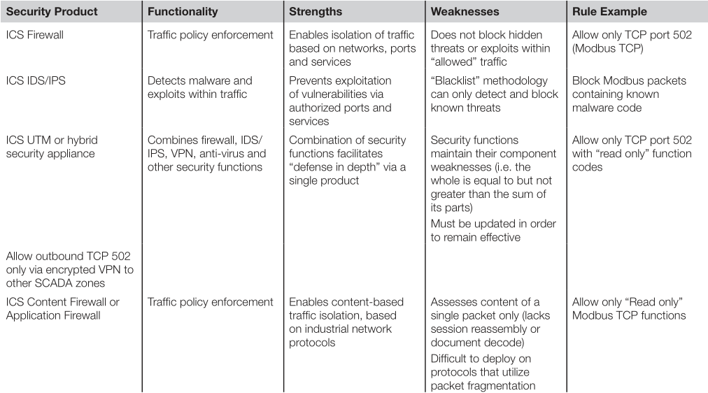

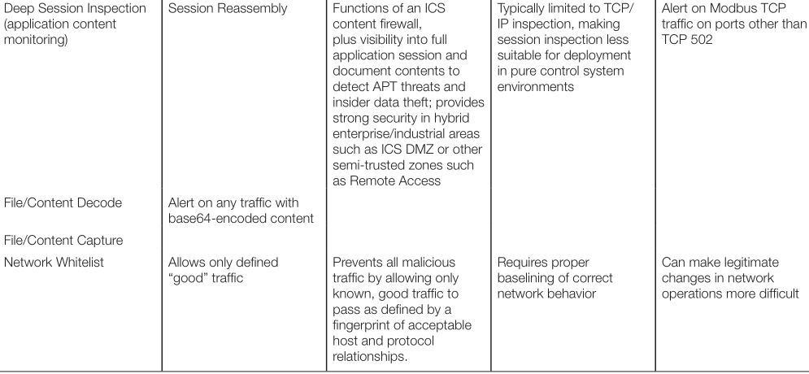

#### Data diodes and unidirectional gateways

Prevent return communications at the physical layer typically over a single fiber-optic communication.

## Implementing Host Security and Access Control

Zones consist of specific devices and applications, and conduits consist of a variety of network communication channels between those devices and applications.
This means that all zones will contain at least one device with a network interface, and therefore it is important to secure the device.

This section includes: Access control (Authentication), Host-based network security (FW, IDS), Anti-malware systems (AV, AWL)

### Selecting host cyber security systems

All host access controls and host network security solutions should be implemented on all network devices.
The problem is that not all of them are capable of running security software and in some cases, may introduce lag.

#### Host firewall

Just like a network firewall.
Acts as a initial filter between the host and any attached networks.

#### Host IDS

Work like network ICS.
Reside on the specific asset and only monitor systems internal to that asset.

#### Anti-virus

Inspect files for malware.
Use signature-based detection to validate system files.

#### Application Whitelisting

Creates a list of what is known to be good.
If it is not on the list, block it.
The AWL only needs to be updated and tested when the applications used on the system are updated.

#### External controls

Required when it is simply not possible to use host-based security tools.

External controls, such as Security Information and Event Management systems, may monitor a control system more holistically, using information available from other assets (such as a master terminal unit or HMI), from other information stores (such as a Data Historian), or from the network itself.

#### Patch Management

Risk, in the context of industrial security, can be thought of as a function of threats (actors, vectors, and targets) and how they exploit system vulnerabilities that result in some form of an undesirable consequence or impact.
You can reduce risk by reducing any of these three mentioned components.

##### Patching as a form of Vulnerability Management

Addresses the notification, preparation, delivery, installation, and validation of software hotfixes or updates designed to correct uncovered deficiencies.
Patch management, in the context of risk reduction, is a means of reducing vulnerabilities in an effort to reduce the resulting risk of a particular target.
It is a “reactive” approach to security rather than a proactive offensive strategy.

##### Leave no vulnerability unturned

Try to mitigate every vulnerability present.
If a network device, such as a Firewall is compromised, the whole network has to be assumed compromised.
If a system such as one running Windows XP is present in the network, and cannot be further patched due to it not being further maintained, the workaround can be to encapsulate it and others which can't be updated in a "zone-based security zone"

##### Maintaining System Availability

##### Comprehensive Pre-deployment Testing

Prior to deploying any patch, it is vital to thoroughly test and validate that the updates will not negatively impact the components being patched.

1. Confirmation from the device manufacturer that a particular patch is acceptable to install. 

The devices that are very old, cannot be simulated in the simulator, and therefore we cannot know if the patch will break them or not. 
This leaves the vendor two options:

* No not deploy the patch
* Do not test the patch before deployment

To minimize any negative impact to operations and system availability, end users should test ALL patches and updates before deployment.

##### Automating the process

As the ICS have been around since the 1980, vendor-specific implementations of patches and updates have been created.
The patching management solution must be able to handle this diversity.

This process has to be automated to provide a reasonable level of assurance.
Group assets by criticality, duplicity and redundancy and allowing patches to be issued first to low-risk assets, then to medium risk, and finally to high-risk assets.
Finally, critical servers are to be updated one by one.

Backups have to be stored and saved.
Versions and patches have to be taken note of.

When updating firmware, it is important to have spare equipment at hand, because bricking may occur.

### How much security is enough

One of the most important factors to consider when deploying a security control is how it helps to reduce the risk of a cyber event from negatively impacting the ICS and the production assets under its control.
A well thought out security program will always balance the “cost of security” versus the “cost of impact.”

# 11. Exception, Anomaly, and Threat Detection

Exception reporting refers to an automated system that notifies the security administrators whenever a defined policy has been violated.

Anomaly detection provides a rule-less method of identifying possible threat behaviour.

## Exception reporting

At a basic level, exception reporting might be used to inform an operator when something that should not have been allowed, has occurred. 

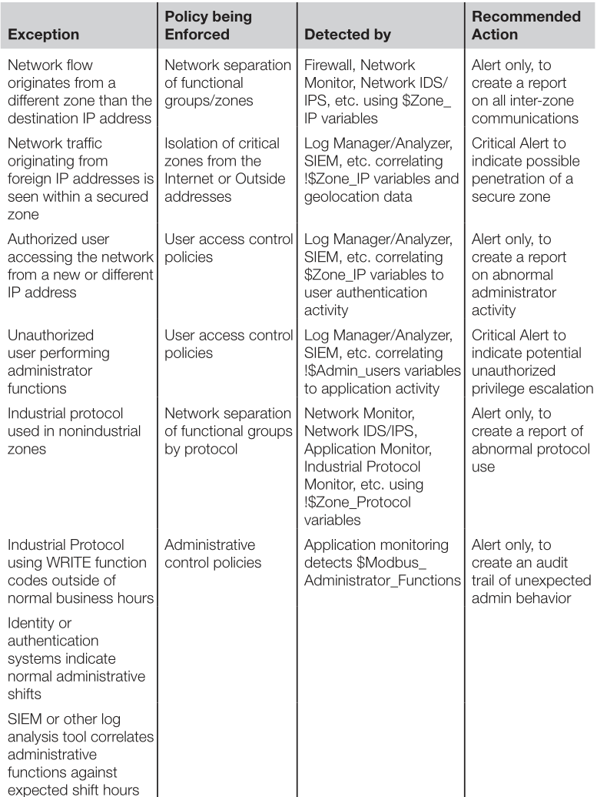
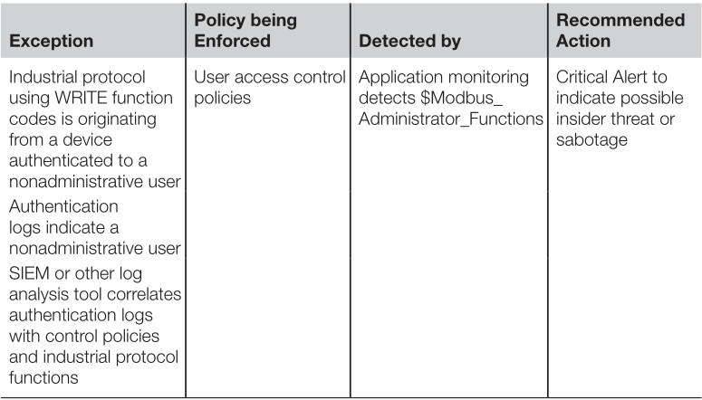

Exceptions cannot be determined without an understanding of the policies that are in place.

## Behavioral Anomaly Detection

Network-expected behaviour but logically unexpected.

We can check for this behaviour either manually (Logs) or automatically (SIEM) but we will always need a degree of human interaction.

### Measuring baselines

Baselines are time-lagged calculations based on running averages.
They provide a base for comparison against expected value.
Baselines are useful when comparing passed behaviour with current behaviour.
Baselines can be as complex or as simple as you want them to be.
A simple baseline would be to average a year's network traffic.
Everything above the average, is prone to be due to market fluctuation or malign behaviour.

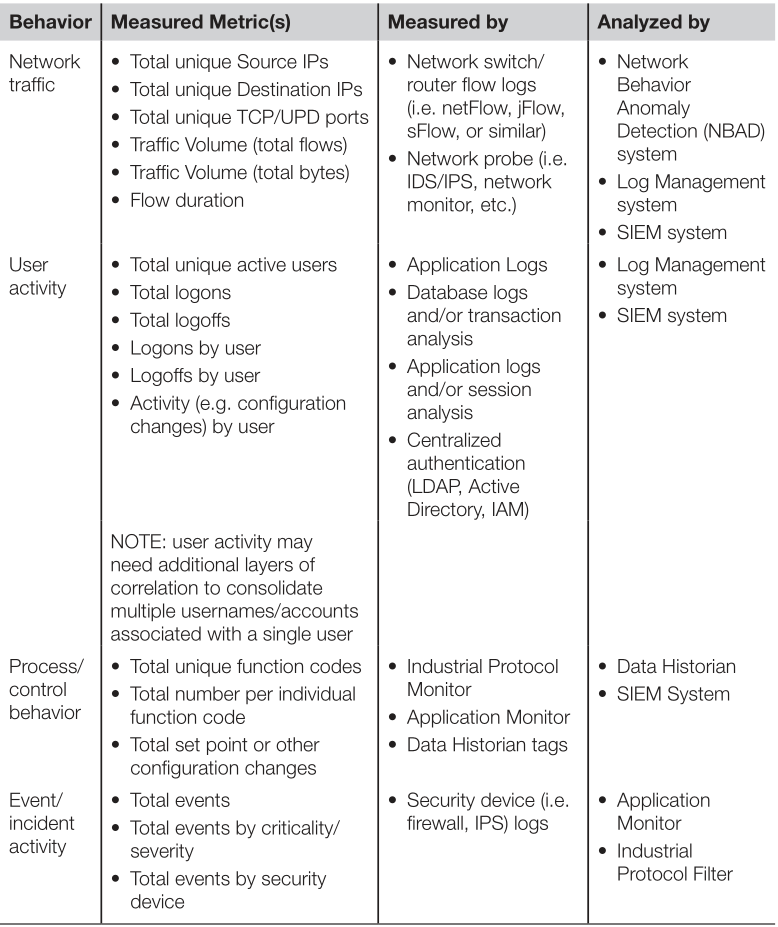

### Anomaly Detection

An anomaly is something that happens outside of normal defined parameters or boundaries of operation.
They can be found in NBAD, log management and SIEM systems.

The rate of false positives tends to be higher using anomaly detection techniques.

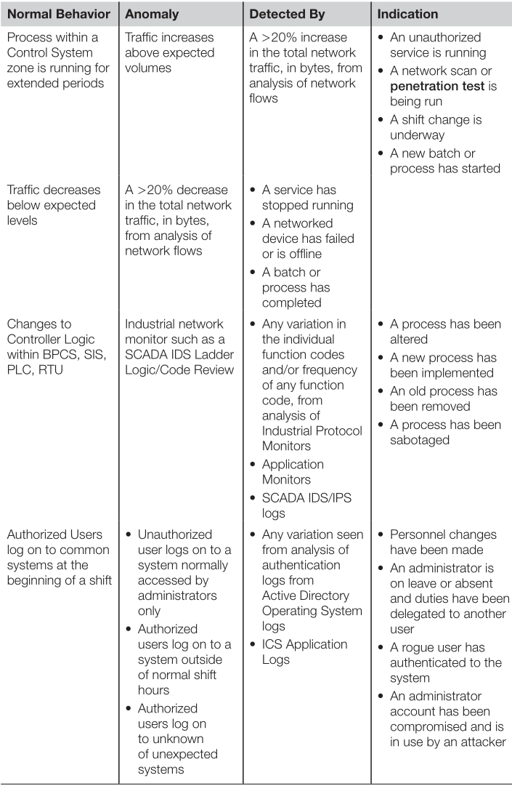

## Behavioral Whitelisting

Whitelists can be defined for a variety of network and security metrics, including users, assets, applications and others.

### User whitelists

It is very important to understand user activity, especially of administrative users.

Authorized users have been previously identified, and therefore can be whitelisted.
As with exception reporting, the whitelist is first defined and then monitored activity is compared against it.
If the user is on the list, nothing happens.
If the user is not on the list, it is assumed something bad, and the security personnel is notified.

### Asset whitelists

The list of allowed devices (Network scan / manual inventory) can be used to whitelist them.
If a untrusted device is connected to the network, the IP address of the device will be detected by the network switches, routers and monitors and will eventually be seen in logs.
At this point, comparison with the defined whitelist devices will render the device untrustworthy.

### application whitelists

Application behaviour can also be whitelisted but we have to be specially define the allowed behaviour.

Some examples of application whitelisting features in industrial networks are:

* Only read-only function codes are allowed
* Only specifically defined function codes are allowed

Unlike AWL systems that only allow certain authorised applications to execute, application behaviour whitelisting only allows applications authorised to execute to function in specific ways on the network.

#### Smart-lists

Combines the concept of behavioral whitelisting with a degree of deductive intelligence.
Where blacklists block what is known to be bad, and whitelists only allow what is known to be good, Smart-lists use the latter to help dynamically define the former.

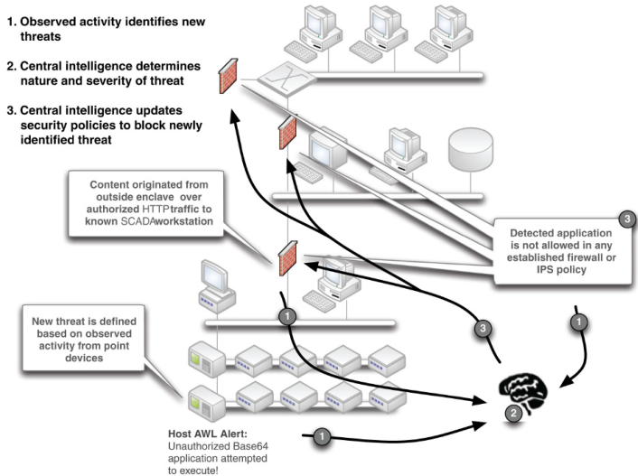

## Threat detection

For the detection of an incident (Vs a discrete event) it is necessary to look at multiple events together and search for broader patterns.
The detection of this larger threat pattern is known as event correlation. 
The problem is that event correlation systems where not designed to accommodate OT systems, presenting challenges in the detection of the most serious threats to an industrial network.

### Event correlation

Event correlation simplifies threat detection process by making sense of the massive amounts of discrete event data, analyzing it as a whole to find the important patterns and incidents that require immediate attention.

### Data enrichment

The process of appending or otherwise enhancing collected data with relevant context obtained from additional sources.
(If a username is found within a application log, the username can be referenced against a central IAM system to obtain the user's actual name, departmental roles, privileges, and so on.)

Data enrichment can occur in two ways:

* Performing a lookup at the time of collection and appending the contextual information into the log.
* Perform a lookup at the time the event is scrutinized by the SIEM or log management system.

### Normalization

Is a classification system that categorizes events according to a defined taxonomy, such as the Common Event Expression Framework provided by the MITRE Corporation.

### Cross-Source Correlation

Extend correlation across multiple sources, so that common events from disparate systems may be normalised and correlated together.

### Tiered correlation 

The use of one correlation rule within another correlation rule.

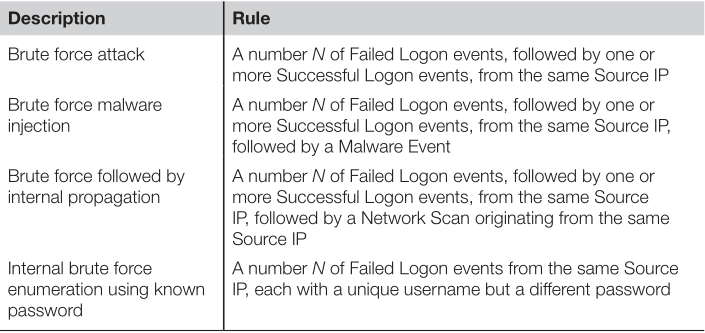

## Correlating between IT and OT systems

The challenge here is the disparity between the two systems.
IT systems are monitored heavily for performance and security whereas OT systems are monitored primarily for process efficiency and performance.

To fully leverage the automated correlation capability built into most IT SIEM products, OT data must first be collected into the SIEM, and then the normalization of one metric to another must be made using a common threat taxonomy.

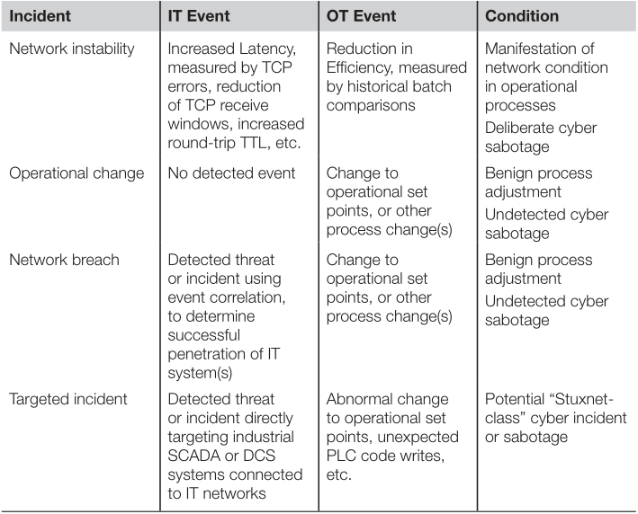

# 12. Security Monitoring of Industrial Control Systems

It is a challenge to manage so many logs in a normal network, but even more difficult in a ICS given the challenge of security zones.

## Determining what to monitor

Ideally, monitor everything.
But realistically, we have to decide what to monitor.
One approach is to segregate monitoring by zone.
There are limited assets and activities within a zone, and therefore there are less total logs and events.
Some OT devices, such as PLCs, RTUs and IEDs don't produce event logs, but do produce information.
For these devices, recover the information from the data historian.

### Security events

Are those produced by security and infrastructure systems (Network or Host-based firewalls, network routers and switches, IDS, IPS, etc.)
Any event generated by security and infrastructure systems, should be promiscuous.

False positives should be minimized by tuning of the faulty detection signatures.
To ensure accurate threat detection and correlation, all legitimately produced events should be retained short-term for live analysis and long term for forensic and compliance purposes.

### Assets

The physical devices connected to the network also provide security data in the form of logs. (System logs, Application logs and filesystem logs)

System logs are useful for tracking the status of devices and services that are or not running as well as patches applied or not.

Application logs provide a record of application-specific details that indicate how an application is being used.

Filesystem logs track when files are created changed or deleted, when access privileges or group ownership are changed and similar details.

### Configurations

Refers to the process of monitoring baseline configurations for any indications of change (Although only a small part of CM)
Full CM systems provide additional key functions, typically mapping the security controls outlined in NIST SP 800-53.

### Applications

Application logs can indicate when a application is executed or terminated, who logs into the application, and specific actions performed by users once authenticated.

### Networks

Record communications from a source to one or more destinations.

Provide an overview of the network usage over time and can be useful for:

* Network diagnostics and fault management
* Network traffic management and congestion management
* Network security management
* Application usage

Network flow analysis is extremely useful for security analysis because it provides the information needed to trace the communications surrounding a security incident back to its source.

### User identities and authentication 

Referred to as the person behind the computer.
Have to be normalised, so even if one user uses three different username to connect to multiple machines, the user identity has to default back to the user.
LDAP might help normalize, but it doesn't solve the issue completely.

### Additional context

It is beneficial, but adds additional storage to the monitored network.

### Behavior

Not monitored, rather the analysis of any monitored metric over time.

## Successfully Monitoring Security Zones

As log files are not always enough, monitoring is typically performed using a combination of methods:

* Log collection and analysis
* Direct monitoring or network inspection
* Inferred monitoring via tangential systems

Even if logs can be reviewed manually, automated tools are recommended.

There are two ways to store and manage logs:

* Remain within a functional group (Not centralized)
* Shared between security zones (Centralized, but have to be extremely cautious)

### Log collection

Is the matter of directing the data generated to a log aggregation point.

### Direct monitoring

Is the use of a "probe" to passively examine network traffic on hosts that don't generate logs (RTU's, PLC's)

Also called "passive monitoring" as they don't interact with the device who's packets are being inspected.

### Inferred monitoring

Refers to a situation where one system is monitored in order to infer information about another system.

To determine which tools are needed, start with your zone's perimeter and interior security controls and determine which controls can produce adequate monitoring and which cannot.
If they can, start by aggregating logs from the absolute perimeter to a central log aggregation tool.
Begin aggregating logs from those devices protecting the most critical zones, and work outward until all critical monitoring has been enabled.

### Information connection and management tools

#### Syslog aggregation and log search

Allows log files to be communicated over a network.
This creates a very simple and free aggregation system.
In order for it to be effective, further data analysis tools have to be configured.

#### Log management systems

Provide a commercial solution for log collection, analysis and reporting.

#### Security information and event management systems (SIEM)

Extend the capabilities of Log management systems with the addition of specific analytical and contextual functions.

#### Data historians

Not security monitoring products but useful in Critical Systems because most security log products operate only on TCP and UDP networks, and therefore leave a vast area unmonitored

* Provide visibility into control system assets not visible to typical network monitoring tools
* Provide process efficiency and reliability data that can be useful for security analysis

### Monitoring across secure boundaries

Requires zone perimeter security policies that will allow the security logs and events generated by the monitoring devices to be transfered to a central management console.

Data Diodes are ideal for this application, as they only allow one-way communication.

## Information management

The SIEM or Log Manager will perform many underlying detection functions automatically providing the security analyst with:

* Raw logs and event details
* Larger incidents or more sophisticated threats derived from those raw events
* Associated necessary context to what has been observed and derived

### Queries

Some example queries that can be made against any or all data in datastore:

* Top 10 talkers
* Top events
* Top events over time
* Open ports

### Reports

Select, organise and format all data from the enriched logs and events into a single document.

### Alerts

Active responses against observed conditions within the SIEM.
Can be a e-mail, notification, or other to the security administrator.

### Incident investigation and response

SIEM and log management system are useful because they provide the incident response team with available, targeted information on the actual issue.

In some cases, SIEM may support active response capabilities, such as:

* Allowing direct control over switch or router interfaces via SNMP, to disable network interfaces.
* Executing scripts

## Log storage and retention

The result of security monitoring is a large amount of data.
This has to be stored and secured accordingly.

### Nonrepudiation

The process of ensuring a log file has not been tampered with.
This file, can therefore be admitted in court.
The possible ways of achieving this are:

* Digital signature
  * Hash function
* Protected storage media
  * Use WORM (Write once read many) drives 
* FIM system
  * Observes the log storage facility for signs of tampering

### Data retention/storage

The amount of information that is stored and for what time (For regulation purposes)

Factors to consider when calculating log storage size:

* Quantity of inbound logs
* Average log size
* Period of retention
* Supported file compression ratios

### Data availability

The amount of information that can be analysed concurrently (In volumes or time)

Dependent on the nature of the data store, total data availability may be limited to a number of hours, days or years.

* Total number of columns
* Total number of rows
* Rate at which information is inserted
* Rate at which query results are required

# 13. Standards and regulations

The current state of ICS standards and regulations means there are many standards to adhere to.
One of the most important ones is:  ISA 62443.

## Common standards and regulations

### NERC CIP

Widely known due to the high price of non-compliance.
It's target industry is the North American Bulk electric system

### CFATS

The RBPS for the CFATS outlines various controls for securing the cyber systems.

1. Security policy
2. Access Control
3. Personnel security
4. Awareness and training
5. Monitoring and incident response
6. Disaster recovery and business continuity
7. System development and acquisition
8. Configuration management
9. Audits

## ISO/IEC 27002

Although it is less specific than ISO 27001, it maps specifically to standards from a lot more countries.

## NIST SP 800-82 

Provide recommendations for Security, Management, Operational and Technical controls in order to improve control system security.

## ISA/IEC-62443

Is a series of standards organised to address a series of topics necessary for the implementation of a secure Industrial Automation Control System (IACS)

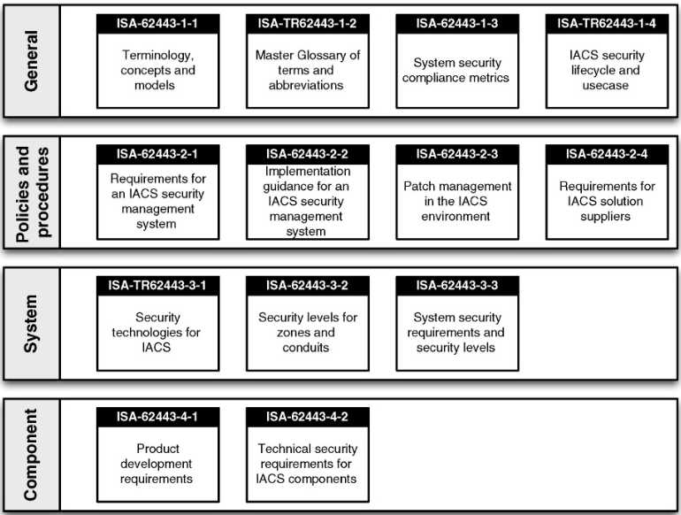

## Mapping industrial network security to compliance

There are many ICS security regulations, guidances and recommendations.
Organizations like the UCF (Unified Compliance Framework) work to unify these.

## Industry best practices for conducting ICS assessments

There are several documents published that discuss various methodologies for testing and assessing IT architecture.

Some agencies that published documents:

* Department of homeland security / Centre for protection of national infrastructure
* National Security Agency
* American Petroleum Institute / National petrochemical and refiners association
* Institute for security and open methodologies (Spain)

## Common criteria and FIPS standards

Certify products rather than standards.
The most important for information security is: FIPS 140-2, that validates information encryption

### Common criteria

Defines both functional and assurance requirements that security vendors can test against on order to validate the security of the product in question.

### FIPS 140-2

Establishes the requirements for the "cryptographic modules" that are used within a cyber asset or system.
There are 4 models, each more thorough than the previous.
